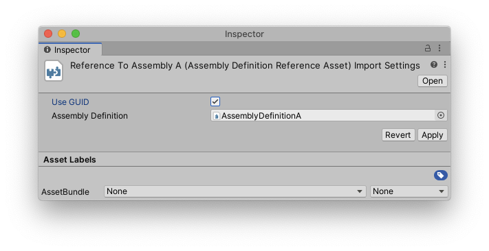

# Assembly Definition Reference properties
**Assembly Definition Reference** 是定义对**Assembly Definition**的引用的资产。在文件夹中创建一个**Assembly Definition Reference**资产以包括脚本在引用的**Assembly Definition**中的该文件夹中（而不是创建新的程序集）。子文件夹中的脚本也将包括在内，除非它们具有自己的**Assembly Definition**或**Assembly Definition Reference**资产。

|Property|Description
|:-------|:------
|Use GUID|此设置控制Unity如何序列化对Assembly Definition资产的引用。启用此属性后，Unity会将引用保存为资产的GUID，而不是程序集定义名称。最好使用GUID代替名称，因为这意味着您可以更改部件定义资产的名称，而不必更新引用该部件的其他部件定义和引用。
|Assembly Definition|引用的程序集定义资产。

参考 [Creating an Assembly Definition Reference asset](https://docs.unity3d.com/Manual/ScriptCompilationAssemblyDefinitionFiles.html#create-asmref)