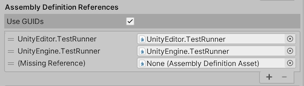
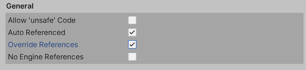
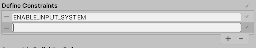
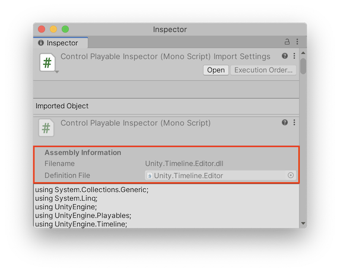

# Assembly definitions
程序集定义和程序集引用是可以创建以组织脚本的资产组装。

程序集是C＃代码库，其中包含脚本定义的已编译类和结构，并且还定义了对其他程序集的引用。有关C＃中程序集的一般信息，请参见[.NET中的程序集](https://docs.microsoft.com/en-us/dotnet/standard/assembly/)。默认情况下，Unity会将几乎所有游戏脚本编译到预定义的程序集Assembly-CSharp.dll中。 
（Unity还创建了[几个较小的，专门的预定义程序集]。）

这种安排适用于小型项目，但是在向项目中添加更多代码时，存在一些缺点：
* 每次更改一个脚本时，Unity必须重新编译所有其他脚本，从而增加了迭代代码更改的总体编译时间。
* 任何脚本都可以直接访问任何其他脚本中定义的类型，这会使重构和改进代码变得更加困难。
* 所有脚本均针对所有平台进行编译。

通过定义程序集，您可以组织代码以提高模块化和可重用性。您为项目定义的程序集中的脚本不再添加到默认程序集中，而只能访问您指定的那些其他程序集中的脚本。  
  
上图说明了如何将项目中的代码拆分为多个程序集。因为Main引用了Stuff而不是相反，所以您知道Main中代码的任何更改都不会影响Stuff中的代码。同样，由于Library不依赖于任何其他程序集，因此您可以更轻松地在另一个项目中重用Library中的代码。

本节讨论如何创建和设置程序集定义和程序集引用资产来为您的项目定义程序集：
* [Defining assemblies](https://docs.unity3d.com/Manual/ScriptCompilationAssemblyDefinitionFiles.html#defining-assemblies)
* [References and dependencies](https://docs.unity3d.com/Manual/ScriptCompilationAssemblyDefinitionFiles.html#reference-and-assemblies)
* [Creating an Assembly Definition asset](https://docs.unity3d.com/Manual/ScriptCompilationAssemblyDefinitionFiles.html#create-asmdef)
* [Creating an Assembly Definition Reference asset](https://docs.unity3d.com/Manual/ScriptCompilationAssemblyDefinitionFiles.html#create-asmref)
* [Creating a platform-specific assembly](https://docs.unity3d.com/Manual/ScriptCompilationAssemblyDefinitionFiles.html#create-platform-specific)
* [Creating an assembly for Editor code](https://docs.unity3d.com/Manual/ScriptCompilationAssemblyDefinitionFiles.html#create-editor-assembly)
* [Creating a test assembly](https://docs.unity3d.com/Manual/ScriptCompilationAssemblyDefinitionFiles.html#create-test-assembly)
* [Referencing another assembly](https://docs.unity3d.com/Manual/ScriptCompilationAssemblyDefinitionFiles.html#reference-another-assembly)
* [Referencing a precompiled, plugin assembly](https://docs.unity3d.com/Manual/ScriptCompilationAssemblyDefinitionFiles.html#reference-precompiled-assembly)
* [Conditionally building an assembly](https://docs.unity3d.com/Manual/ScriptCompilationAssemblyDefinitionFiles.html#conditional-assembly)
* [Defining symbols based on project packages](https://docs.unity3d.com/Manual/ScriptCompilationAssemblyDefinitionFiles.html#define-symbols)
* [Finding which assembly a script belongs to](https://docs.unity3d.com/Manual/ScriptCompilationAssemblyDefinitionFiles.html#find-assembly)
* [Special folders](https://docs.unity3d.com/Manual/ScriptCompilationAssemblyDefinitionFiles.html#special-folders)
* [Getting assembly information in build scripts](https://docs.unity3d.com/Manual/ScriptCompilationAssemblyDefinitionFiles.html#get-assembly-info)

也可以看看：
* [Assembly Definition properties](https://docs.unity3d.com/Manual/class-AssemblyDefinitionImporter.html)
* [Assembly Definition Reference properties](https://docs.unity3d.com/Manual/class-AssemblyDefinitionImporter.html#assembly-definition-reference-properties)
* [Assembly Definition File Format](https://docs.unity3d.com/Manual/AssemblyDefinitionFileFormat.html)

## Defining assemblies
要将项目代码组织到程序集中，请为每个所需的程序集创建一个文件夹，然后将应属于每个程序集的脚本移动到相关文件夹中。然后[create Assembly Definition assets]指定装配体属性。

Unity将所有脚本放入包含Assembly Definition资产的文件夹中，并使用资产定义的名称和其他设置将它们编译为Assembly。 Unity还将脚本包含在同一程序集中的任何子文件夹中，除非该子文件夹具有自己的程序集定义或程序集引用资产。

若要在现有程序集中包含非子文件夹中的脚本，请在非子文件夹中创建程序集引用资源，并将其设置为引用定义目标程序集的程序集定义资源。例如，可以将项目中所有编辑器文件夹中的脚本组合到它们自己的程序集中，而不管这些文件夹位于何处。

Unity按照其依赖关系确定的顺序编译程序集;您无法指定编译的顺序。

## References and dependencies
当一种类型（例如，类或结构）使用另一种类型时，第一种类型依赖于第二种类型。 Unity编译脚本时，它还必须有权访问脚本依赖的任何类型或其他代码。同样，当编译的代码运行时，它必须有权访问其依赖项的编译版本。如果两种类型在不同的程序集中，则包含从属类型的程序集必须声明对包含其依赖类型的程序集的引用。

您可以使用程序集定义的选项控制项目中使用的程序集之间的引用。程序集定义设置包括：
* [Auto Referenced](https://docs.unity3d.com/Manual/class-AssemblyDefinitionImporter.html#general) – Whether the predefined assemblies reference the assembly
* [Assembly Definition References](https://docs.unity3d.com/Manual/class-AssemblyDefinitionReferenceImporter.html) – References to other project assemblies created with Assembly Definitions
* [Override References](https://docs.unity3d.com/Manual/class-AssemblyDefinitionImporter.html#general) + [Assembly References](https://docs.unity3d.com/Manual/ScriptCompilationAssemblyDefinitionFiles.html#reference-another-assembly) – References to precompiled (plugin) assemblies
* [No Engine References](https://docs.unity3d.com/Manual/class-AssemblyDefinitionImporter.html#general) – References to UnityEngine assemblies

注意：使用程序集定义创建的程序集中的类不能使用预定义程序集中定义的类型。

### Default references
默认情况下，predefined assemblies 引用所有其他程序集，包括使用Assembly Definitions（1）创建的程序集和作为插件添加到项目中的precompiled assemblies（2）。此外，使用 Assembly Definition 资产创建的程序集将自动引用所有precompiled assemblies（3）：  


在默认设置中，预定义程序集中的类可以使用项目中任何其他程序集定义的所有类型。同样，使用程序集定义资产创建的程序集可以使用在任何预编译（插件）程序集中定义的所有类型。

通过关闭“检查器定义”资产中检查器中的[Auto Referenced option](https://docs.unity3d.com/Manual/class-AssemblyDefinitionImporter.html#general)选项，可以防止预定义的程序集引用该程序集。关闭自动引用意味着在更改程序集中的代码时不会重新编译预定义的程序集，而且还意味着预定义的程序集不能直接在此程序集中使用代码。请参见[Assembly Definition properties](https://docs.unity3d.com/Manual/class-AssemblyDefinitionImporter.html)。

同样，可以通过关闭插件资源的[Plugin Inspector](https://docs.unity3d.com/Manual/PluginInspector.html)中的[Auto Referenced option](https://docs.unity3d.com/Manual/class-AssemblyDefinitionImporter.html#general)属性来防止插件程序集自动引用。这会影响预定义的程序集以及使用程序集定义创建的程序集。有关更多信息，请参见[Plugin Inspector](https://docs.unity3d.com/Manual/PluginInspector.html)。

当您关闭**plug-in**的**Auto Referenced**，您可以在检查器中为程序集定义资产明确引用它。启用资产的[Override References](https://docs.unity3d.com/Manual/class-AssemblyDefinitionImporter.html#general)选项，然后为插件添加引用。请参见[Assembly Definition properties](https://docs.unity3d.com/Manual/class-AssemblyDefinitionImporter.html)。

注意：您不能为预编译的程序集声明显式引用。预定义程序集只能在自动引用的程序集中使用代码。

### Cyclical references
当一个程序集引用第二个程序集，而第二个程序集又引用第一个程序集时，存在循环程序集引用。程序集之间的此类循环引用是不允许的，并且会作为错误消息报告“检测到循环引用的程序集”。

通常，由于在程序集中定义的类内的循环引用，所以在程序集之间会出现此类循环引用。尽管在同一程序集中的类之间的循环引用在技术上没有任何问题，但是不同程序集中的类之间的循环引用是不允许的。如果遇到循环引用错误，则必须重构代码以删除循环引用或将相互引用的类放在同一程序集中。

## Creating an Assembly Definition asset
要创建程序集定义资产：
1. 在**Project**窗口中，找到包含要包含在程序集中的脚本的文件夹。
2. 在文件夹中创建一个Assembly Definition资产（菜单：**Assets > Create > Assembly Definition**）。
3. 为资产分配一个名称。默认情况下，程序集文件使用您分配给资产的名称，但是您可以在检查器中更改名称窗口。

Unity重新编译项目中的脚本以创建新的程序集。完成后，您可以更改新的装配体定义的设置。

包含程序集定义的文件夹中的脚本，包括任何子文件夹中的脚本（除非这些文件夹包含其自己的程序集定义或引用资产），都将被编译到新程序集中并从其先前的程序集中删除。

## Creating an Assembly Definition Reference asset
要创建程序集定义引用资产：
1. 在**Project**窗口中，找到包含要包含在引用的程序集中的脚本的文件夹。
2. 在文件夹中创建一个程序集参考资产（菜单：**Assets > Create > Assembly Definition Reference**）。
3. 为资产分配一个名称。Unity重新编译项目中的脚本以创建新的程序集。完成后，您可以更改新的**Assembly Definition Reference**的设置。
4. 选择新的**Assembly Definition Reference**资产以在检查器中查看其属性。

5. 设置 Assembly Definition 属性以引用目标程序集定义资产。
6. 点击 **Apply**。

包含**Assembly Definition Reference**资产的文件夹中的脚本，包括任何子文件夹中的脚本（除非这些文件夹包含其自己的**Assembly Definition**或**Reference**资产），都会被编译到引用的程序集中，并从其先前的程序集中删除。

## Creating a platform-specific assembly
要为特定平台创建装配：
1. [创建装配体定义资产]。
2. 选择新的**Assembly Definition Reference**资产以在**Inspector**中查看其属性。

3. 选中**Any Platform**选项，然后选择要排除的特定平台。或者，您可以取消选中**Any Platform**，然后选择要包含的特定平台。
4. 点击 **Apply**。

在为平台构建项目时，将根据所选平台包括（或排除）该程序集。

## Creating an assembly for Editor code
编辑器程序集允许您将编辑器脚本放置在项目中的任何位置，而不仅仅是放置在名为**Editor**的顶级文件夹中。
要创建一个包含项目中的编辑器代码的程序集，请执行以下操作：
1. 在包含您的编辑器脚本的文件夹中[Creating a platform-specific assembly](https://docs.unity3d.com/Manual/ScriptCompilationAssemblyDefinitionFiles.html#create-platform-specific)。
2. 仅包括编辑器平台。
3. 如果您还有其他包含编辑器脚本的文件夹，请在这些文件夹中[创建**Assembly Definition Reference assets**]并将其设置为引用此**Assembly Definition**。

## Creating a test assembly
测试程序集允许您编写测试并使用Unity TestRunner运行它们，同时还可以将测试代码与应用程序附带的代码分开。 Unity将TestRunner作为[Test Framework软件包]的一部分提供。请参阅[Test Framework文档]，以获取有关安装Test Framework程序包和创建测试程序集的说明。

## Referencing another assembly
要使用属于另一个程序集的C＃类型和函数，必须在程序集定义资产中创建对该程序集的引用。
要创建程序集引用：
1. 选择需要引用才能在检查器中查看其属性的装配的**Assembly Definition**。
2. 在**Assembly Definition References**中，单击“ +”按钮以添加新引用。

3. 将程序集定义资产分配给引用列表中新创建的插槽。


启用**Use GUIDs**选项可让您更改引用的Assembly Definition资产的文件名，而无需更新其他Assembly Definition中的引用以反映新名称。 （请注意，如果删除了资产文件的元数据文件，或者您在Unity编辑器外部将文件移动而不同时将元数据文件与它们一起移动，则必须重置GUID。）

## Referencing a precompiled, plugin assembly
默认情况下，项目中使用Assembly Definitions创建的所有程序集都会自动引用所有预编译的程序集。这些自动引用意味着，即使不使用程序集中的代码，在更新任何一个预编译程序集时，Unity也必须重新编译所有程序集。为了避免这些额外的开销，您可以覆盖自动引用，并仅指定对程序集实际使用的那些预编译库的引用：
1. 选择需要引用才能在**Inspector**中查看其属性的装配的**Assembly Definition**。
2. 在**General**部分中，启用**Override References**选项。

选中**Override References**后，**Inspector**的**Assembly References**部分将变为可用。
3. 在**Assembly References**部分中，单击+按钮以添加新引用。
4. 使用空插槽中的下拉列表将引用分配给预编译的程序集。该列表显示了项目[Build Settings](https://docs.unity3d.com/Manual/BuildSettings.html)中当前设置的平台在项目中的所有预编译程序集。 （在[Plugin Inspector](https://docs.unity3d.com/Manual/PluginInspector.html)中为预编译的程序集设置平台兼容性。）
5. 点击 **Apply**。
6. 对要为其构建项目的每个平台重复上述步骤。

## Conditionally including an assembly
您可以使用预处理器符号来控制程序集是否已编译并包含在游戏或应用程序的版本中（包括编辑器中的播放模式）。
您可以在**Assembly Definition**选项中的**Define Constraints**列表中指定必须为装配体定义的符号：
1. 选择程序集的Assembly Definition以在检查器中查看其属性。
2. 在**Define Constraints**部分中，单击+按钮，将新符号添加到约束列表中。

3. 输入符号名称。您可以通过在名称前面放置一个感叹号来“取反”该符号。例如，当未定义**UNITY_WEBGL**时，约束 !**UNITY_WEBGL** 将包括程序集。
4. 点击 **Apply**。

您可以使用以下符号作为约束：
* 在[Scripting Define Symbols](https://docs.unity3d.com/Manual/class-PlayerSettingsStandalone.html#Configuration)设置中定义的符号，您可以在**Project Settings**的**Player**部分中找到该符号。请注意，**Scripting Define Symbols**适用于项目[Build Settings](https://docs.unity3d.com/Manual/BuildSettings.html)中当前设置的平台。要为多个平台定义符号，必须切换到每个平台并分别修改**Scripting Define Symbols**字段。
* Unity定义的符号。请参阅[Platform dependent compilation](https://docs.unity3d.com/Manual/PlatformDependentCompilation.html)。
* 使用Assembly Definition资产的[Version Defines]部分定义的符号。

确定是否满足约束时，不考虑脚本中定义的符号。
有关其他信息，请参见[Define Constraints](https://docs.unity3d.com/Manual/ScriptCompilationAssemblyDefinitionFiles.html#define-constraints)。

## Defining symbols based on project packages
如果您需要根据项目使用特定的程序包还是程序包的版本来在程序集中编译不同的代码，则可以将条目添加到**Version Defines**列表中。此列表指定何时应定义符号的规则。对于版本号，您可以指定一个逻辑表达式，该表达式的计算结果为特定版本或一系列版本。

要有条件地定义符号：
1. 选择装配体的装配体定义以在检查器中查看其属性。
2. 在**Version Defines**部分中，单击“ +”按钮以将条目添加到列表中。
3. 设置属性：
    * Resource：选择必须安装的软件包或模块才能定义此符号
    * Define：符号名称
    * Expression：计算结果为特定版本或版本范围的表达式。有关规则，请参见[版本定义表达式]。

    **Expression outcome**显示表达式评估的版本。
    如果项目使用时间轴1.3.0或更高版本，则以下示例定义符号USE_TIMELINE：
    
4. 点击 **Apply**。

程序集定义中定义的符号仅在为该定义创建的程序集中的脚本的范围内。
请注意，您可以将使用**Version Defines**列表定义的符号用作**Define Constraints**。因此，您可以指定仅当项目中安装了给定软件包的特定版本时才使用程序集。

## Version Define expressions
您可以使用表达式指定确切的版本或版本范围。**Version Define**表达式使用数学范围表示法。方括号“ []”表示范围包括端点：  
`[1.3,3.4.1] evaluates to 1.3.0 <= x <= 3.4.1`

括号“（）”表示范围不包括端点：  
`(1.3.0,3.4) evaluates to 1.3.0 < x < 3.4.0`

您可以在单个表达式中混合使用两种范围类型：  
`[1.1,3.4) evaluates to 1.1.0 <= x < 3.4.0`  
`(0.2.4,5.6.2-preview.2] evaluates to 0.2.4 < x <= 5.6.2.-preview.2`

您可以在方括号中使用单个版本指示符来指定确切的版本：  
`[2.4.5] evaluates to x = 2.4.5`

作为快捷方式，您可以输入一个不带括号的单个版本，以表示该表达式包含该版本或更高版本：  
`2.1.0-preview.7 evaluates to x >= 2.1.0-preview.7`

版本指示符分为四个部分，遵循语义[Semantic Versioning format](https://semver.org)：MAJOR.MINOR.PATCH-LABEL。前三个部分始终是数字，但标签是字符串。预览中的Unity软件包使用字符串Preview或preview.n，其中n>0。您必须在表达式中至少使用版本的主要和次要组件。

注意：表达式中不允许使用空格。

## Finding which assembly a script belongs to
要确定您的C＃脚本之一被编译到哪个程序集中，请执行以下操作：
1. 在“ Unity项目”窗口中选择C＃脚本文件，以在“检查器”窗口中查看其属性。
2. 程序集文件名和程序集定义（如果存在）将显示在检查器的“程序集信息”部分中。


在此示例中，所选脚本被编译到库文件Unity.Timeline.Editor.dll中，该文件由Unity.Timeline.Editor程序集定义资产定义。

## Special folders
Unity将具有特定特殊名称的文件夹中的脚本与其他文件夹中的脚本区别对待。但是，当您在其中的一个文件夹中或上方的一个文件夹中创建一个Assembly Definition资产时，其中一个文件夹将失去特殊处理。使用“编辑器”文件夹时，您可能会注意到此更改，该文件夹可能分散在整个项目中（取决于组织代码的方式和所使用的Asset包）。

通常，无论这些脚本位于何处，Unity都会将名为Editor的文件夹中的所有脚本编译到预定义Assembly-CSharp-Editor程序集中。但是，如果您在其下面具有“编辑器”文件夹的文件夹中创建“程序集定义”资产，则Unity不再将这些编辑器脚本放入预定义的“编辑器”程序集中。相反，它们会进入您的程序集定义创建的新​​程序集中-它们可能不属于该程序集。要管理编辑器文件夹，可以在每个编辑器文件夹中创建程序集定义或参考资产，以将这些脚本放置在一个或多个编辑器程序集中。请参阅为[编辑器代码创建程序集](https://docs.unity3d.com/Manual/ScriptCompilationAssemblyDefinitionFiles.html#create-editor-assembly)。

## Setting assembly attributes
您可以使用程序集属性来设置程序集的元数据属性。按照约定，程序集属性语句通常放在一个名为AssemblyInfo.cs的文件中。

例如，以下程序集属性指定了一些.NET程序集元数据值，InternalsVisibleTo属性（可用于测试）以及Unity定义的Preserve属性，该属性影响在构建项目时如何从程序集中删除未使用的代码：
```cs
[assembly: System.Reflection.AssemblyCompany("Bee Corp.")]
[assembly: System.Reflection.AssemblyTitle("Bee's Assembly")]
[assembly: System.Reflection.AssemblyCopyright("Copyright 2020.")]
[assembly: System.Runtime.CompilerServices.InternalsVisibleTo("UnitTestAssembly")]
[assembly: UnityEngine.Scripting.Preserve]
```

## Getting assembly information in build scripts
在**UnityEditor.Compilation**命名空间中，使用**CompilationPipeline**类检索有关Unity为项目构建的所有程序集的信息，包括基于程序集定义资产创建的程序集。

例如，以下脚本使用**CompilationPipeline**类列出项目中的所有当前Player程序集：
```cs
using UnityEditor;
using UnityEditor.Compilation;
public static class AssemblyLister
{
    [MenuItem("Tools/List Player Assemblies in Console")]
    public static void PrintAssemblyNames()
    {
        UnityEngine.Debug.Log("== Player Assemblies ==");
        Assembly[] playerAssemblies =
            CompilationPipeline.GetAssemblies(AssembliesType.Player);

        foreach (var assembly in playerAssemblies)
        {
            UnityEngine.Debug.Log(assembly.name);
        }
    }
}
```