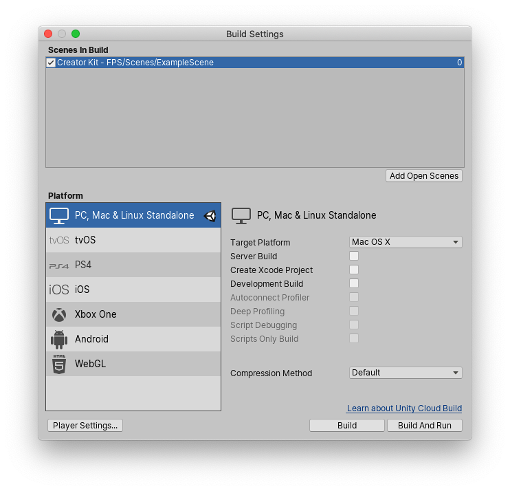
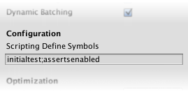

# Platform dependent compilation
Unity的**Platform Dependent Compilation**功能由一些预处理程序指令组成，可用于对脚本进行分区专门为其中一个受支持的平台编译和执行一段代码。

您可以在Unity编辑器中运行此代码，因此可以针对目标平台专门编译代码并在编辑器中对其进行测试。

## Platform #define directives
Unity支持您的脚本的平台#define指令如下：
|Define|Function
|:-----|:------
|UNITY_EDITOR|#define directive to call Unity Editor scripts from your game code.
|UNITY_EDITOR_WIN|#define directive for Editor code on Windows.
|UNITY_EDITOR_OSX|#define directive for Editor code on Mac OS X.
|UNITY_EDITOR_LINUX|#define directive for Editor code on Linux.
|UNITY_STANDALONE_OSX|#define directive to compile or execute code specifically for Mac OS X (including Universal, PPC and Intel architectures).
|UNITY_STANDALONE_WIN|#define directive for compiling/executing code specifically for Windows standalone applications.
|UNITY_STANDALONE_LINUX|#define directive for compiling/executing code specifically for Linux standalone applications.
|UNITY_STANDALONE|#define directive for compiling/executing code for any standalone platform (Mac OS X, Windows or Linux).
|UNITY_WII|#define directive for compiling/executing code for the Wii console.
|UNITY_IOS|#define directive for compiling/executing code for the iOS platform.
|UNITY_IPHONE|Deprecated. Use UNITY_IOS instead.
|UNITY_ANDROID|#define directive for the Android platform.
|UNITY_PS4|#define directive for running PlayStation 4 code.
|UNITY_XBOXONE|#define directive for executing Xbox One code.
|UNITY_LUMIN|#define directive for the Magic Leap OS platform. You can also use PLATFORM_LUMIN.
|UNITY_TIZEN|#define directive for the Tizen platform.
|UNITY_TVOS|#define directive for the Apple TV platform.
|UNITY_WSA|#define directive for Universal Windows Platform. Additionally, NETFX_CORE is defined when compiling C# files against .NET Core and using .NET scripting backend.
|UNITY_WSA_10_0|#define directive for Universal Windows Platform. Additionally WINDOWS_UWP is defined when compiling C# files against .NET Core.
|UNITY_WINRT|Same as UNITY_WSA.
|UNITY_WINRT_10_0|Equivalent to UNITY_WSA_10_0
|UNITY_WEBGL|#define directive for WebGL.
|UNITY_FACEBOOK|#define directive for the Facebook platform (WebGL or Windows standalone).
|UNITY_ANALYTICS|#define directive for calling Unity Analytics methods from your game code. Version 5.2 and above.
|UNITY_ASSERTIONS|#define directive for assertions control process.
|UNITY_64|#define directive for 64-bit platforms.

您还可以选择编译代码。可用的选项取决于您正在使用的编辑器的版本。给定版本号X.Y.Z（例如2.6.0），Unity以以下格式公开三个全局#define指令：UNITY_X，UNITY_X_Y和UNITY_X_Y_Z。

这是Unity 5.0.1中公开的#define指令的示例：
|Define|Function
|:-----|:------
|UNITY_5|#define directive for the release version of Unity 5, exposed in every 5.X.Y release.
|UNITY_5_0|#define directive for the major version of Unity 5.0, exposed in every 5.0.Z release.
|UNITY_5_0_1|#define directive for the minor version of Unity 5.0.1.

从Unity 5.3.4开始，您可以根据编译或执行给定代码部分所需的最早Unity版本来有选择地编译代码。给定与上述（X.Y.Z）相同的版本格式，Unity公开一个全局#define，格式为UNITY_X_Y_OR_NEWER，​​可用于此目的。

支持的#define指令为：

|Define|Function
|:-----|:------
|CSHARP_7_3_OR_NEWER|Defined when building scripts with support for C# 7.3 or newer.
|ENABLE_MONO|Scripting backend #define for Mono.
|ENABLE_IL2CPP|Scripting backend #define for IL2CPP.
|NET_2_0|Defined when building scripts against .NET 2.0 API compatibility level on Mono and IL2CPP.
|NET_2_0_SUBSET|Defined when building scripts against .NET 2.0 Subset API compatibility level on Mono and IL2CPP.
|NET_LEGACY|Defined when building scripts against .NET 2.0 or .NET 2.0 Subset API compatibility level on Mono and IL2CPP.
|NET_4_6|Defined when building scripts against .NET 4.x API compatibility level on Mono and IL2CPP.
|NET_STANDARD_2_0|Defined when building scripts against .NET Standard 2.0 API compatibility level on Mono and IL2CPP.
|ENABLE_WINMD_SUPPORT|Defined when Windows Runtime support is enabled on IL2CPP. See Windows Runtime Support for more details.
|ENABLE_INPUT_SYSTEM|Defined when the Input System package is enabled in Player Settings.
|ENABLE_LEGACY_INPUT_MANAGER|Defined when the legacy Input Manager is enabled in Player Settings.

您可以使用DEVELOPMENT_BUILD #define来确定您的脚本是否在使用“**Development Build**”构建的播放器中运行”选项已启用。

您还可以根据脚本后端选择性地编译代码。

## Testing precompiled code
下面是如何使用预编译代码的示例。它会打印一条消息，该消息取决于您为目标构建选择的平台。

首先，通过转到**File > Build Settings**，选择要用来测试代码的平台。这将显示**Build Settings**窗口。从此处选择您的目标平台。  
  
*Build Settings window with PC, Mac & Linux selected as the target platforms*

选择您要针对其测试预编译代码的平台，然后单击**Switch Platform**以告诉Unity您要定位的平台。  
创建一个脚本并复制/粘贴以下代码：
```cs
// C#
using UnityEngine;
using System.Collections;

public class PlatformDefines : MonoBehaviour {
  void Start () {

    #if UNITY_EDITOR
      Debug.Log("Unity Editor");
    #endif
    
    #if UNITY_IOS
      Debug.Log("Iphone");
    #endif

    #if UNITY_STANDALONE_OSX
    Debug.Log("Stand Alone OSX");
    #endif

    #if UNITY_STANDALONE_WIN
      Debug.Log("Stand Alone Windows");
    #endif

  }          
}
```
要测试代码，请单击**Play Mode**。通过检查Unity控制台中的相关消息来确认代码是否有效，具体取决于您选择的平台-例如，如果您选择iOS，消息“ Iphone”被设置为出现在控制台中。

在C＃中，您可以使用**CONDITIONAL**属性，这是一种更简洁，错误更少的剥离函数方法。有关更多信息，请参见[ConditionalAttribute类](https://msdn.microsoft.com/en-us/library/system.diagnostics.conditionalattribute(v=vs.110).aspx)。请注意，常见的Unity回调（例如Start（），Update（），LateUpdate（），FixedUpdate（），Awake（））不受此属性影响，因为它们是直接从引擎调用的，并且出于性能原因，它确实
不考虑它们。

除了基本的#if编译器指令，您还可以在C＃中使用多路测试：
```cs
#if UNITY_EDITOR
    Debug.Log("Unity Editor");

#elif UNITY_IOS
    Debug.Log("Unity iPhone");

#else
    Debug.Log("Any other platform");

#endif
```

## Platform custom #defines
也可以通过提供自己的方法添加到#define指令的内置选择中。打开播放器设置的**Other Settings**面板，然后导航到**Scripting Define Symbols**文本框。

  

输入要为该特定平台定义的符号名称，以分号分隔。然后，这些符号可以用作#if指令的条件，就像内置符号一样。

## Global custom #defines
您可以定义自己的预处理程序指令，以控制编译时包括哪些代码。为此，您必须将带有额外指令的文本文件添加到**Assets**夹。文件的名称取决于您使用的语言。扩展名是.rsp： 
|||
|:--|:--
|C# (player and editor scripts)| **<@Project Path>/Assets/mcs.rsp**

例如，如果在mcs.rsp文件中包含单行-define：UNITY_DEBUG，则#define指令UNITY_DEBUG作为C＃脚本的全局#define存在，但编辑器脚本除外。

每次对.rsp文件进行更改时，都需要重新编译才能使它们生效。您可以通过更新或重新导入单个脚本（.js或.cs）文件来实现。

注意：**如果只想修改全局#define指令，请在“播放器”设置中使用 Scripting Define Symbols**，因为这涵盖了所有编译器。如果改为选择.rsp文件，则需要为Unity使用的每个编译器提供一个文件。.rsp文件的使用在mcs应用程序的“帮助”部分中进行了说明，该文件包含在Editor安装文件夹中。您可以通过运行mcs -help获得更多信息。

请注意，.rsp文件需要与正在调用的编译器匹配。例如：
* 以.NET 3.5等效（不建议使用）脚本运行时版本为目标时，mcs与mcs.rsp一起使用
* 当面向.NET 4.x等效脚本运行时版本编译器时，csc与csc.rsp一起使用。