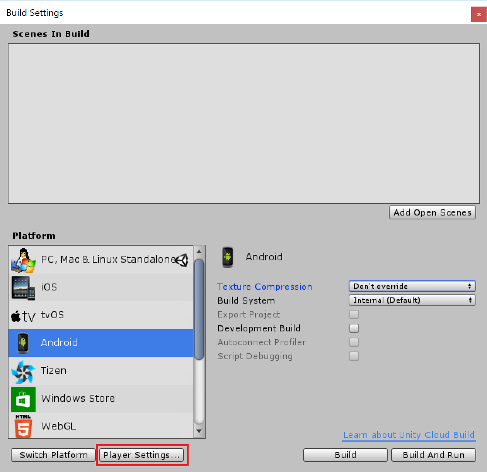
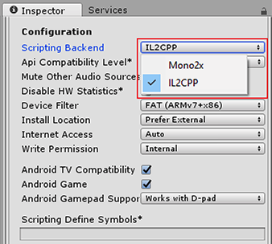

# Building a project using IL2CPP
要使用IL2CPP构建项目，请打开**Build Settings**窗口（**File > Build Settings**）。选择要构建的平台，然后单击**Player Settings**在**Inspector**中打开**Player Settings**。

---
  
*The Build Settings window*  

在**Project Settings**中窗口中，找到目标平台的**Player Settings**，然后向下滚动到**Configuration**部分。对于**Scripting Backend**，选择**IL2CPP**。  

*The Configuration section of the Player settings*

将IL2CPP选择为脚本后端，然后在“构建设置”窗口中单击“生成”。在为目标平台生成二进制文件之前，Unity开始将C＃代码和程序集转换为C++的过程。