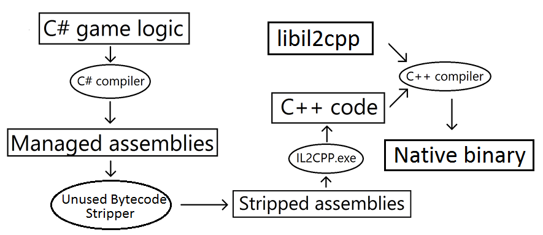

# How IL2CPP works
使用IL2CPP开始构建时，Unity自动执行以下步骤：
* 将Unity Scripting API代码编译为常规.NET DLL（托管程序集）。
* 应用托管字节码剥离。此步骤大大减少了内置游戏的大小。
* 将所有托管程序集转换为标准C ++代码。
* 使用本机平台编译器编译生成的C ++代码和IL2CPP的运行时部分。
* 将代码链接到可执行文件或DLL中，具体取决于您所针对的平台。
  
*A diagram of the automatic steps taken when building a project using IL2CPP*

IL2CPP提供了一些有用的选项，您可以通过脚本中的属性进行控制。有关更多信息，请参见平台相关编译的文档。