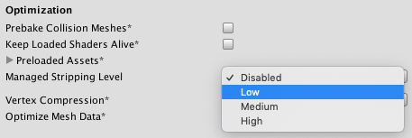

# Managed code stripping
托管代码剥离可从构建中删除未使用的代码，这会大大减小最终构建的大小。使用IL2CPP时在脚本编写脚本的后端，托管代码剥离还可以减少构建时间，因为需要转换为C ++并编译的代码较少。托管代码剥离可从托管程序集中删除代码，包括从C＃脚本构建的程序集在您的项目中，是程序包和插件一部分的程序集，以及.NET框架中的程序集。

托管代码剥离的工作原理是静态分析项目中的代码，以检测执行期间无法访问的类，类的成员，甚至功能的某些部分。
您可以使用**Player Settings**上的**Managed Stripping Level**设置来控制Unity如何修剪无法访问的代码窗口（在**Optimization**部分）。

重要：当您的代码（或插件中的代码）使用反射动态查找类或成员时，代码剥离工具无法始终检测到Project正在使用这些类或成员，并可能将其删除。要声明项目正在使用此类代码，请使用link.xml文件或Preserve属性。

## Managed stripping levels
通过项目**Player Settings**中的**Managed Stripping Level**选项，控制Unity主动修剪未使用代码的方式。  
  
*Managed Stripping Level setting*

**注意**：此选项的默认值根据当前的脚本后端而有所不同设置。
|Property|Function
|:-------|:-----
|Disabled|没有代码被删除。此选项是Mono脚本后端的默认剥离级别。选择IL2CPP脚本后端时，“禁用”选项不可用，因为它会对构建时间产生影响。更多的托管代码意味着IL2CPP可以生成更多的C ++代码，这意味着需要编译更多的C ++代码。结果是从更改代码到看到实际更改之间的时间更长。
|Low|根据保守的规则集删除代码，该规则应删除大多数无法访问的代码，同时最大程度地减少剥离实际使用的代码的可能性。低剥离级别有利于可用性，而不是减小尺寸。</br>此选项是IL2CPP的默认剥离级别（已用于Unity编辑器的许多发行版）。
|Medium|根据在低剥离级别和高剥离级别之间取得平衡的一组规则删除代码。中等剥离级别比低剥离级别要谨慎一些，但是与高剥离级别相比并没有那么极端。这样，删除代码带来的不良副作用的风险大于低剥离级别，但小于高剥离级别。</br>在IL2CPP脚本后端使用中型剥离级别，可以进一步减少进行代码更改和测试之间的迭代时间。</br>当您使用 .NET 3.5脚本运行时版本设置时，中等剥离级别不可用。
|High|与中型剥离级别相比，删除尽可能多的无法访问的代码，并生成较小的内部版本。高剥离级别优先考虑减小尺寸而不是可用性；您可能需要添加link.xml文件，**Preserve**属性或重写有问题的代码段。</br>高剥离级别执行更耗时的分析以实现这些额外的大小减少，因此构建和迭代时间可能比中剥离级别下更长。</br>当您使用.NET 3.5脚本运行时版本设置时，高剥离级别不可用。

Note: The Managed Stripping Level options do not affect the process that removes unused Unity Engine code (which is available when using the IL2CPP Scripting Backend setting).

## Understanding managed code stripping
本节描述托管代码剥离的详细信息以及如何识别和纠正可能出现的任何相关问题。

当您在Unity中构建项目时，构建过程会将C＃代码编译为.NET字节码格式，称为通用中间语言（CIL）。此CIL字节代码打包到称为程序集的文件中。同样，您在Project中使用的插件中的.NET框架库和所有C＃库也已预先打包为CIL字节码的程序集。通常，无论您的项目使用的程序集中的代码是多少，构建过程都将包含整个程序集文件。

托管代码剥离过程分析项目中的程序集，以查找和删除未实际使用的代码。该分析使用一组规则来确定保留哪些代码以及丢弃哪些代码。这些规则在构建大小（包括太多代码）和风险（删除太多代码）之间进行权衡。托管剥离级别设置使您可以控制删除代码的积极程度。

### UnityLinker
Unity构建过程使用一个称为UnityLinker的工具来剥离托管代码。 UnityLinker是Mono IL Linker的一个版本，自定义为可与Unity一起使用。 UnityLinker构建在我们项目的分支之上，该分支密切跟踪上游IL Linker项目。 （请注意，fork中未维护UnityLinker的自定义Unity Engine特定部分。）

#### How the UnityLinker works
UnityLinker分析项目中的所有装配。首先，它标记了顶层，根类型，方法，属性，字段等，例如您添加到GameObjects的MonoBehaviour派生的类。在一个场景中是根类型。然后，UnityLinker分析其已标记以标识的根，并标记这些根所依赖的任何托管代码。完成此静态分析后，任何残留的未标记代码将无法通过应用程序代码通过任何执行路径访问，并从程序集中删除。  
*请注意，此过程不会混淆代码。*

### Reflection and code stripping
UnityLinker不能总是检测到项目中的代码通过反射引用其他代码的实例，并且会错误地删除实际使用的代码。随着**Managed Stripping Level**从低到高的提高，代码剥离导致游戏中意外行为更改的风险也会增加。此类行为更改的范围从微妙的逻辑更改到因调用缺少的方法而导致的崩溃。

UnityLinker可以检测并处理一些反射模式。有关它可以处理的最新模式的示例，请参见Mono IL Linker反[射测试套件](https://github.com/mono/linker/tree/master/linker/Tests/Mono.Linker.Tests.Cases/Reflection)。但是，当您超越普通的反射用法时，必须为UnityLinker提供一些提示，提示不应该触摸哪些类。您可以以**link.xml**文件和**Preserve**属性的形式提供这些提示：
* Preserve attribute — mark elements to preserve directly in source code.
* link.xml file — declare how elements in assemblies should be preserved.

UnityLinker在分析程序集中未使用的代码时，会将使用属性或link.xml文件保留的每个元素视为根。

#### Preserve attribute
在源代码中使用[[Preserve](https://docs.unity3d.com/ScriptReference/Scripting.PreserveAttribute.html)]属性，以防止UnityLinker剥离该代码。下表描述了将Preserve应用于不同代码元素时UnityLinker保留哪些实体：
* Assembly: 保留程序集中的所有类型（就像在每种类型上都放置[Preserve]属性一样）。要将Preserve属性分配给程序集，请将属性声明放置在程序集中包含的任何C＃文件中，而不是任何名称空间声明：
```cs
using System;
using UnityEngine.Scripting;

[assembly: Preserve]

namespace Example
{
    public class Foo {}
}
```
* Type: 保留类型及其默认构造函数。
* Method: 保留方法，方法的声明类型，返回类型及其所有参数的类型。
* Property: 保留属性，声明类型，值类型，getter方法和setter方法。
* Field: 保留字段，声明类型和字段类型。
* Event: 保留事件，它是声明类型，返回类型，add方法和remove方法。
* Delegate: 保留委托类型及其所有方法。

请注意，在link.xml文件中标记代码实体比使用Preserve属性时具有更多控制权。例如，用Preserve属性装饰一个类可以保留类型和默认构造函数。使用link.xml文件，您可以选择仅保留类型（不使用默认构造函数）。

您可以在任何程序集中和任何命名空间中定义Preserve属性。因此，您可以使用UnityEngine.Scripting.PreserveAttribute类，对其进行子类化或创建自己的PreserveAttribute类，例如：
```cs
class Foo
{
    [UnityEngine.Scripting.Preserve]
    public void UsingUnityPreserve(){}

    [CustomPreserve]
    public void UsingCustomPreserve(){}

    [Preserve]
    public void UsingOwnPreserve(){}
}

class CustomPreserveAttribute : UnityEngine.Scripting.PreserveAttribute {}

class PreserveAttribute : System.Attribute {}
```

#### AlwaysLinkAssembly attribute
使用[assembly：UnityEngine.Scripting.AlwaysLinkAssembly]属性强制UnityLinker处理该程序集，而不管该构建中包含的另一个程序集是否引用该程序集。 [AlwaysLinkAssembly](https://docs.unity3d.com/ScriptReference/Scripting.AlwaysLinkAssemblyAttribute.html)属性只能在程序集上定义。

该属性仅指示UnityLinker将其根标记规则应用于部件。该属性本身不会直接导致程序集中的代码被保留。如果没有代码元素与程序集的根标记规则匹配，则UnityLinker仍将从构建中删除程序集。

在包含具有[RuntimeInitializeOnLoadMethod]属性的一个或多个方法，但可能不包含在项目中任何场景中直接或间接使用的类型的程序包或预编译程序集上，请使用此属性。

如果程序集定义了[assembly：AlwaysLinkAssembly]，并且该程序集中包含的另一个程序集也引用了该程序集，则该属性对输出无效。

#### Link XML
link.xml文件是每个项目的列表，声明了如何保留程序集以及其中的类型和其他代码实体。要使用link.xml文件，请创建它（请参见下面的示例）并将其放置在Project Assets文件夹（或Assets的任何子目录）中。您可以在Project中使用任意数量的link.xml文件，因此插件可以提供自己的保存声明。 UnityLinker将保留在link.xml文件中的所有程序集，类型或成员视为根类型。

请注意，程序包内部不支持link.xml文件，但是您可以从非程序包link.xml文件中引用程序包程序集。

以下示例说明了使用link.xml文件声明项目程序集的根类型的不同方法：
```xml
<linker>
  <!--
  Preserve types and members in an assembly
  -->
  <assembly fullname="Assembly1">
    <!--Preserve an entire type-->
    <type fullname="Assembly1.A" preserve="all"/>

    <!--No "preserve" attribute and no members specified 
        means preserve all members-->
    <type fullname="Assembly1.B"/>

    <!--Preserve all fields on a type-->
    <type fullname="Assembly1.C" preserve="fields"/>

    <!--Preserve all fields on a type-->
    <type fullname="Assembly1.D" preserve="methods"/>

    <!--Preserve the type only-->
    <type fullname="Assembly1.E" preserve="nothing"/>

    <!--Preserving only specific members of a type-->
    <type fullname="Assembly1.F">
        
      <!--
      Fields
      -->
      <field signature="System.Int32 field1" />

      <!--Preserve a field by name rather than signature-->
      <field name="field2" />
      
      <!--
      Methods
      -->
      <method signature="System.Void Method1()" />

      <!--Preserve a method with parameters-->
      <method signature="System.Void Method2(System.Int32,System.String)" />

      <!--Preserve a method by name rather than signature-->
      <method name="Method3" />

      <!--
      Properties
      -->

      <!--Preserve a property, it's backing field (if present), 
          getter, and setter methods-->
      <property signature="System.Int32 Property1" />

      <property signature="System.Int32 Property2" accessors="all" />

      <!--Preserve a property, it's backing field (if present), and getter method-->
      <property signature="System.Int32 Property3" accessors="get" />

      <!--Preserve a property, it's backing field (if present), and setter method-->
      <property signature="System.Int32 Property4" accessors="set" />

      <!--Preserve a property by name rather than signature-->
      <property name="Property5" />

      <!--
      Events
      -->

      <!--Preserve an event, it's backing field (if present), 
          add, and remove methods-->
      <event signature="System.EventHandler Event1" />

      <!--Preserve an event by name rather than signature-->
      <event name="Event2" />

    </type>

    <!--Examples with generics-->
    <type fullname="Assembly1.G`1">

      <!--Preserve a field with generics in the signature-->
      <field signature="System.Collections.Generic.List`1&lt;System.Int32&gt; field1" />

      <field signature="System.Collections.Generic.List`1&lt;T&gt; field2" />

      <!--Preserve a method with generics in the signature-->
      <method signature="System.Void Method1(System.Collections.Generic.List`1&lt;System.Int32&gt;)" />

      <!--Preserve an event with generics in the signature-->
      <event signature="System.EventHandler`1&lt;System.EventArgs&gt; Event1" />

    </type>

    <!--Preserve a nested type-->
    <type fullname="Assembly1.H/Nested" preserve="all"/>

    <!--Preserve all fields of a type if the type is used.  If the type is not 
        used it will be removed-->
    <type fullname="Assembly1.I" preserve="fields" required="0"/>

    <!--Preserve all methods of a type if the type is used.  
        If the type is not used it will be removed-->
    <type fullname="Assembly1.J" preserve="methods" required="0"/>

    <!--Preserve all types in a namespace-->
    <type fullname="Assembly1.SomeNamespace*" />

    <!--Preserve all types with a common prefix in their name-->
    <type fullname="Prefix*" />

  </assembly>
  
  <!--Preserve an entire assembly-->
  <assembly fullname="Assembly2" preserve="all"/>

  <!--No "preserve" attribute and no types specified means preserve all-->
  <assembly fullname="Assembly3"/>

  <!--Fully qualified assembly name-->
  <assembly fullname="Assembly4, Version=0.0.0.0, Culture=neutral, PublicKeyToken=null">
    <type fullname="Assembly4.Foo" preserve="all"/>
  </assembly>

  <!--Force an assembly to be processed for roots but don’t explicitly preserve 
      anything in particular.  Useful when the assembly is not referenced.-->
  <assembly fullname="Assembly5" preserve="nothing"/>

</linker>
```

##### Special Assembly XML attributes
link.xml文件的<assembly>元素具有三个特殊用途的属性：
* **ignoreIfMissing**  
    默认情况下，如果找不到在link.xml文件中引用的程序集，则UnityLinker中止构建。如果需要声明在所有Player构建期间都不存在的程序集的保留，请在link.xml文件的<assembly>元素上使用ignoreIfMissing属性：
    ```xml
    <linker>
    <assembly fullname="Foo" ignoreIfMissing="1">
        <type name="Type1"/>
    </assembly>
    </linker>
    ```
* **ignoreIfUnreferenced**  
    在某些情况下，您可能只想在另一个程序集引用该程序集时保留该程序集中的实体。在link.xml文件的<assembly>元素上使用ignoreIfUnreferenced属性，仅在程序集中引用了至少一种类型时才保留程序集中的实体。
    ```xml
    <linker>
    <assembly fullname="Bar" ignoreIfUnreferenced="1">
        <type name="Type2"/>
    </assembly>
    </linker>
    ```
    **注意**：引用程序集中的代码本身是否被剥离都没有关系，带有该属性的引用程序集中的指定元素仍将保留。

* **windowsruntime**
    在为Windows运行时元数据（.winmd）程序集定义保留时，必须将windowsruntime =“ true”属性添加到link.xml文件中的<assembly>元素：
    ```xml
    <linker>
    <assembly fullname="Windows" windowsruntime="true">
        <type name="Type3"/>
    </assembly>
    </linker>
    ```

## How the UnityLinker strips assemblies
Unity编辑器整理包含您Unity项目中任何场景中使用的类型的程序集列表，并将其传递给UnityLinker。然后，UnityLinker处理这些程序集，这些程序集的任何引用，在link.xml文件中声明的任何程序集以及具有AlwaysLinkAssembly属性的任何程序集。通常，项目中包含的任何不属于这些类别之一的程序集都不会被UnityLinker处理，也不会包含在Player版本中。

对于UnityLinker处理的每个程序集，它会根据程序集的分类，程序集是否包含场景中使用的类型以及为构建选择的托管剥离级别，遵循一组规则。

为了这些规则的目的，程序集分为以下几类：
* **.NET Class Library assemblies** — 包括Mono类库（例如mscorlib.dll和System.dll）以及.NET类库外观程序集（例如netstandard.dll）。
* **Platform SDK assemblies** — 包括特定于平台SDK的托管程序集。例如，作为通用Windows平台一部分的windows.winmd程序集SDK。
* **Unity Engine Module assemblies** — 包括组成Unity Engine的托管程序集，例如UnityEngine.Core.dll。
* **Project assemblies** — 包括特定于项目的程序集，例如：
    * 脚本程序集，例如Assembly-CSharp.dll
    * 预编译程序集
    * [装配体定义装配体](https://docs.unity3d.com/Manual/ScriptCompilationAssemblyDefinitionFiles.html)
    * 包装组件

以下各节详细介绍UnityLinker如何为每个托管剥离级别设置标记和保留或剥离汇编代码：
* Low Stripping Level
* Medium Stripping Level
* High Stripping Level

### Low Stripping Level
当您选择**Low Managed Stripping Level**时，UnityLinker会根据保守的规则集删除代码，该规则应删除大多数无法访问的代码，同时最大程度地减少实际使用的剥离代码的可能性。低剥离级别有利于提高可用性，而不是减小尺寸。

#### Low root marking rules
根标记规则决定了UnityLinker如何识别装配中的顶级类型。
|Assembly Type|Action|Root Marking Rules
|:------------|:-----|:------
|.NET Class & Platform SDK|	Strip|应用预防性保存</br>在任何link.xml中定义的保留
|Assemblies containing types used in a scene|Copy|标记装配中的所有类型和成员
|All other|Strip|1. 标记所有公共类型<br>2. 标记所有公共类型的公共成员</br>3. 标记具有[RuntimeInitializeOnLoadMethod]属性的方法</br>4. 标记具有[Preserve]属性的类型和成员</br>5. 在任何link.xml中定义的保留</br>6. 在以下位置标记从MonoBehaviour和ScriptableObject派生的所有类型：</br>* 预编译的程序集</br>* 包装组装</br>* 装配体定义装配体</br>* Unity脚本程序集
|Test|Strip|用NUnit.Framework中定义的任何属性标记方法。例如：[Test]</br>用[UnityTest]属性标记方法

**注意**：Strip操作表示UnityLinker分析程序集以查找可删除的代码。复制动作意味着UnityLinker将整个程序集复制到最终版本（以及将其中的所有类型标记为根类型）。

#### Low dependency marking rules
标记了根类型后，UnityLinker会执行静态分析以识别这些根所依赖的任何代码。
|Rule Target|Description
|:----------|:---------
|Unity Types|1. 当UnityLinker标记从MonoBehaviour派生的类型时，它还会标记该类型的所有成员。</br>当UnityLinker标记从ScriptableObject派生的类型时，它还会标记该类型的所有成员。
|Attributes|UnityLinker在所有标记的程序集，类型，方法，字段，属性等上标记所有属性。
|Debugging Attributes|UnityLinker在所有标记的程序集，类型，方法，字段，属性等上标记所有属性。
|.NET Facade Class Library Assembly|外观程序集是.NET类库中的程序集，它们将类型定义转发到另一个程序集。例如，netstandard.dll（是.NET Standard 2.0 API兼容性级别的一部分）是一个外观程序集，它定义了.NET接口，但将该接口的实现转发给了其他.NET程序集。</br>在运行时，幕墙程序集并不是严格必需的，但是，由于您可以编写依赖于它们的反射代码，因此Low stripping level将保留这些程序集。

#### DebugDisplay Attribute example
在下面的示例中，假定您在代码的任何地方都不使用属性Foo.UnusedProperty。通常，UnityLinker会删除该属性，但是启用脚本调试时，由于Foo的[DebuggerDisplay]属性，它会标记Foo.UnusedProperty并保留它。

### Medium Stripping Level
|Assembly Type|Action|Root Marking Rules
|:------------|:-----|:------
|.NET Class & Platform SDK|	Strip|与 Low stripping level 相同，除了：不应用预防性保留</br>在任何link.xml中定义的保留
|Assemblies containing types used in a scene|Strip|不会自动标记装配中的所有类型和成员</br>1. 标记具有[RuntimeInitializeOnLoadMethod]属性的方法</br>2. 标记具有[Preserve]属性的类型和成员</br>3. 在任何link.xml中定义的保留</br>4. 在以下位置标记从MonoBehaviour和ScriptableObject派生的所有类型：</br>* 预编译的程序集</br>* 包装组装</br>* 装配体定义装配体</br>* Unity脚本程序集
|All other|Strip|与低剥离级别相同，除了：</br>公共类型不会自动标记</br>公共类型的公共成员不会自动标记
|Test|Strip|与低剥离级别相同

#### Medium dependency marking rules
|Rule Target|Description
|:----------|:---------
|Unity Types|与低剥离级别相同
|Attributes|与低剥离级别相同
|Debugging Attributes|与低剥离级别相同
|.NET Facade Class Library Assembly|与低剥离级别相同

### High Stripping Level
当您选择**High Managed Stripping Level**时，UnityLinker会删除尽可能多的不可达代码，并且生成的构建要比中等剥离级别小。高剥离级别优先考虑减小尺寸而不是可用性；您可能需要添加link.xml文件，保留属性，甚至重写有问题的代码段。

#### High root marking rules
|Assembly Type|Action|Root Marking Rules
|:------------|:-----|:------
|.NET Class & Platform SDK|Strip|与中剥离水平相同
|Assemblies with types referenced in a scene|Strip|与中剥离水平相同
|All other|Strip|与中剥离水平相同
|Test|Strip|与低剥离水平相同

##### Link XML feature tag exclusions
Link.xml文件支持一种不常用的“功能” XML属性。对于此示例，嵌入在mscorlib.dll中的mscorlib.xml文件使用此属性，但是您可以在适当的情况下在任何link.xml文件中使用它。
在高级剥离期间，UnityLinker会根据当前构建的设置排除不支持的功能的保留：
* remoting — 定位IL2CPP脚本后端时不包括在内。
* sre — 定位IL2CPP脚本后端时不包括在内。
* com — 定位不支持COM的平台时不包括在内。

例如，以下link.xml文件在支持COM的平台上保留一种类型的方法，而在所有平台上保留一种方法：
```xml
<linker>
    <assembly fullname="Foo">
        <type fullname="Type1">
            <!--Preserve FeatureOne on platforms that support COM-->
            <method signature="System.Void FeatureOne()" feature="com"/>
            <!--Preserve FeatureTwo on all platforms-->
            <method signature="System.Void FeatureTwo()"/>
        </type>
    </assembly>
</linker>
```

#### High dependency marking rules
|Rule Target|Description
|:----------|:---------
|Unity Types|与低剥离级别相同
|Attributes|1. 在所有标记的程序集，类型和成员上，如果还标记了属性类型，则UnityLinker会标记属性。</br>2. 注意，UnityLinker始终保留某些属性，因为运行时需要它们。</br>3. UnityLinker从所有程序集，类型和成员中删除与安全性相关的属性，例如 System.Security.Permissions.SecurityPermissionAttribute。
|Debugging Attributes|UnityLinker始终删除调试属性，例如DebuggerDisplayAttribute和DebuggerTypeProxyAttribute。
|.NET Facade Class Library Assembly|1. 与保留所有.NET外观组合的“低”和“中”剥离级别不同，“高剥离”级别删除所有外观，因为在运行时不需要它们。</br>2. 假定外观在剥离后仍存在的反射代码将不起作用。

##### Editing of method bodies
设置高剥离级别时，UnityLinker会编辑方法主体，以进一步减小代码大小。本节总结了UnityLinker对方法主体所做的一些值得注意的编辑。  
UnityLinker当前仅编辑.NET类库程序集中的方法主体。
请注意，在方法主体编辑之后，程序集的源代码不再与程序集中的已编译代码匹配，这会使调试更加困难。

###### Remove unreachable branches
UnityLinker会删除检查System.Environment.OSVersion.Platform且对于当前目标平台不可访问的If语句块。

###### Inlining - Field access only methods
UnityLinker通过直接访问字段来替换对获取或设置字段的方法的调用。这通常可以完全剥离该方法，从而有助于减小尺寸。

定位到Mono后端时，仅当允许该方法的调用者根据字段的可见性直接访问该字段时，UnityLinker才会进行此更改。对于IL2CPP，可见性规则不适用，因此UnityLinker在适当的地方进行此更改。

###### Inlining - Const return value methods
UnityLinker内联对简单返回const值的方法的调用。

###### Empty non-returning call removal
UnityLinker删除对空的并且具有无效返回类型的方法的调用。

###### Empty scope removal
当Final块为空时，UnityLinker会删除Try / Finally块。删除空调用可以创建空的Final块。在方法编辑期间发生这种情况时，UnityLinker会删除整个Try / Finally块。发生这种情况的一种情况是，编译器在foreach循环中生成Try / Finally块以调用Dispose（）。