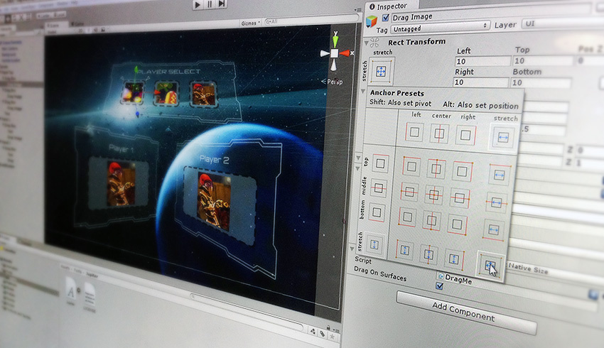

# User interfaces (UI)
  

Unity提供了以下用于创建UI的用户界面（UI）工具包在Unity编辑器或应用程序中：
* UIElements：**[User Interface Elements (UIElements)](https://docs.unity3d.com/Manual/UIElements.html)**是用于在Unity Editor中开发用户界面的保留模式UI工具箱。 UIElements基于公认的Web技术，并支持样式表，动态和上下文事件处理以及数据持久性。
* Unity UI（软件包）：[Unity User Interface (Unity UI)](https://docs.unity3d.com/Manual/com.unity.ugui.html) 包提供了一个简单的UI工具包，用于开发游戏和应用程序的用户界面。 Unity UI是基于GameObject的UI系统，它使用组件和Game View来排列，定位和设置用户界面的样式。您不能在Unity Editor中将Unity UI用于用户界面。
* IMGUI：[Immediate Mode Graphical User Interface](https://docs.unity3d.com/Manual/GUIScriptingGuide.html)是一个代码驱动的UI工具包，主要用作开发人员的工具。 IMGUI使用OnGUI函数（以及实现OnGUI函数的脚本）绘制和管理其用户界面。您可以使用IMGUI创建游戏中的调试显示，自定义检查器用于脚本组件以及扩展Unity Editor的窗口或工具。这不是构建游戏或应用程序UI的最佳选择。

## Selecting a UI toolkit
您应该根据对以下问题的答案来选择UI工具箱：
* 您是否正在开发游戏或应用程序，工具或Unity编辑器扩展？
* 如果您是为游戏或应用程序开发的，您是否随游戏或应用程序一起提供了UI？

||Runtime dev UI | Runtime game UI | Unity Editor
|:---|:-----|:-----|:---
|UIElements|TBD|TBD|✔
|Unity UI|✔|✔|not available
|IMGUI|for debugging|not recommmended|✔

## Disclaimer
UIElements仍在积极开发中。它准备成为游戏内和Unity Editor UI开发的推荐UI工具包。在此之前，Unity UI和IMGUI中有一些UIElements中没有的功能。此外，在早期版本的Unity中可能不存在对UIElements的更改。如果升级，则可能还需要从Unity的先前版本升级您的界面。