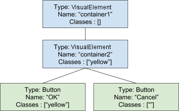

# USS selectors
为了演示选择器，本主题使用以下可视化树示例：  
  
*Example hierarchy*

## Simple selectors
一个简单的选择器可以是通配符，也可以是类型，名称或类名称的任意组合。基于上面的示例可视树，以下是有效的简单选择器的一些示例：
* #container1
* VisualElement
* VisualElement#container1
* VisualElement.yellow
* Button#OK.yellow:hover

### Type
```
TypeName { ... }
```
使用类型选择器可以根据元素的C＃类型来匹配它。例如，Button匹配两个按钮。

使用类型选择器时，仅指定具体的对象类型。不要在类型名称中包含名称空间。

### Name
```
#name { ... }
```

使用名称选择器可基于元素的VisualElement.name属性值来匹配该元素。例如，＃Cancel根据其名称匹配第二个按钮。

元素名称在面板中应该是唯一的。不会强制执行此建议，但是使用非唯一名称可能会导致意外匹配。

为元素分配名称时，请勿包含＃。

### Class
```
.class { ... }
```

使用“类”选择器匹配分配给特定类的元素。

要匹配元素，选择器不必指定分配给元素的所有类。指定单个类名将匹配分配给同一类的元素。例如，.yellow匹配名为container2的元素和名为OK的按钮元素。

如果在选择器中指定多个类，则要使元素匹配，必须为其分配相同的类名。

不包括。当您将类别名称分配给元素时。

类名不能以数字开头。

### Wildcard
```
* { ... }
```
匹配任何元素。

### Pseudo-states
```
:pseudo-state { ... }
```
当元素进入特定状态时，使用伪状态来匹配它。例如，Button：hover匹配Button类型的可视元素，但仅当用户将光标置于可视元素上时才匹配。

支持的伪状态：
* hover : the cursor is hovering over the visual element.
* active : the visual element is being interacted with.
* inactive : the visual element is no longer being interacted with.
* focus : the visual element has focus.
* selected : unused.
* disabled : the visual element is set to enabled == false.
* enabled : the visual element is set to enabled == true.
* checked : the visual element is a Toggle element and it is checked.
* root : the highest-level visual element in the tree.

在其他简单选择器之后指定伪状态。伪状态不能扩展。只有一组预定义的受支持伪状态。

## Complex selectors
复杂选择器是简单选择器与定界符的组合。复杂的选择器还包括选择器列表，这些列表提供了将相同样式应用于许多元素的简化方法。

### Delimiters
UIElements支持以下定界符：
* 空（或空格）分隔符匹配元素的所有子代。
* “大于”符号（>）与视觉元素匹配，这些可视元素是由前面的选择器匹配的元素的直接后代。

例如 ：
* #container1 .yellow : matches both the inner element and the first button
* #container2 > .yellow : matches only the inner element

### Selector List
使用选择器列表将相同的样式定义应用于许多元素。每个选择器都用逗号分隔，每个选择器可以是简单选择器，也可以是复杂选择器。

例如 ：
```
#container1, Button { padding-top:10 }
```
是相同的
```
#container1 { padding-top: 10 } Button { padding-top: 10}
```

## Selector precedence
如果多个选择器与同一个元素匹配，则具有最高特异性的选择器优先。对于简单的选择器，基本特异性规则为：
* Name is more specific than,
* Class, which is more specific than,
* Type, which is more specific than,
* wildcard *.

如果在同一样式表中两个选择器相等，则文件中最后出现的选择器优先。

为了确定不同文件之间的选择器特异性，该算法首先将用户定义样式表中的选择器优先于Unity提供的默认样式表。

解析优先级的第二种方法是遍历样式应用树的顺序。附加到具有较高深度和同级索引的元素的样式表优先。

请注意，！important关键字将被忽略。

最后，在C＃中设置的值始终具有最高的特异性，并将覆盖USS中的任何样式。