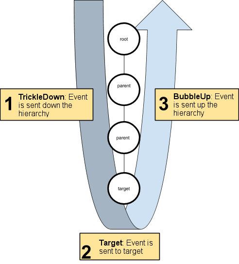

# Dispatching Events
UIElements侦听来自操作系统或脚本的事件，并使用EventDispatcher将这些事件分配到视觉元素。
事件分派器为其发送的每个事件确定适当的分派策略。确定后，调度程序将执行该策略。

视觉元素和其他支持类为多个事件实现默认行为。有时，这涉及创建和发送其他事件。例如，一个MouseMoveEvent可以生成一个附加的MouseEnterEvent和一个MouseLeaveEvent。这些附加事件被放入队列中，并在当前事件完成后进行处理。例如，在处理MouseEnterEvent和MouseLeaveEvent事件之前，完成MouseMoveEvent。

## Event target
`EventDispatcher.DispatchEvent（）`的第一个任务是找到事件的目标。

有时这很容易，因为已经设置了事件目标属性。但是，对于大多数源自操作系统的事件，情况并非如此。

事件的目标取决于事件类型。对于鼠标事件，目标通常是鼠标正下方的最高可拾取元素。对于键盘事件，目标是当前关注的元素。

找到目标后，它将存储在`EventBase.target`中，该事件在调度过程中不会更改。属性`Event.currentTarget`正在处理事件时更新为当前的元素。

### Picking mode and custom shapes
大多数鼠标事件都使用拾取模式来确定其目标。 VisualElement类具有pickingMode属性，该属性支持以下值：
* PickingMode.Position（默认）：根据位置矩形执行拾取。
* PickingMode.Ignore：防止由于鼠标事件而进行拾取。

您可以重写`VisualElement.ContainsPoint（）`方法以执行自定义交叉逻辑。

### Capturing the mouse
有时，在鼠标向下移动后，元素必须捕获鼠标位置以确保所有后续鼠标事件都专门发送给自身，即使指针不再悬停在元素上也是如此。这是典型的控件，它对鼠标按下和鼠标按下的顺序有反应，在鼠标按下和鼠标按下事件之间可能发生鼠标移动。例如，当您单击按钮，滑块或滚动条时。

要捕获鼠标，请调用`element.CaptureMouse（）`或`MouseCaptureController.CaptureMouse（）`。

要释放鼠标，请调用`MouseCaptureController.ReleaseMouse（）`。如果在调用`CaptureMouse（）`时另一个元素已经在捕获鼠标，则该元素会收到`MouseCaptureOutEvent`并丢失捕获。

应用程序中只有一个元素可以随时捕获。尽管元素具有捕获功能，但它是所有后续鼠标事件（鼠标滚轮事件除外）的目标。

注意：这仅适用于尚未设置目标的鼠标事件。

### Focus ring and the tab order
每个UIElement面板都有一个聚焦环，用于定义元素的聚焦顺序。默认情况下，通过在视觉元素树上执行深度优先搜索（DFS）来确定元素的焦点顺序。例如，下面描述的树的焦点顺序为F，B，A，D，C，E，G，I，H。  
  
*Focus order*

一些事件使用焦点顺序来确定哪个元素保持焦点。例如，键盘事件的目标是当前保持焦点的元素。

使用focusable属性控制元素的可聚焦性。默认情况下，VisualElements不可聚焦，但是某些子类（例如TextField）在默认情况下可聚焦。

使用`tabIndex`属性可以如下控制焦点顺序（tabIndex默认值为0）：

* 如果tabIndex为负，则该元素不可制表。
* 如果tabIndex为零，则该元素将保留其默认的Tab键顺序，这由聚焦环算法确定。
* 如果tabIndex为正，则该元素放置在tabIndex为零（tabIndex = 0）或更高tabIndex的其他元素之前。

## Event propagation
选择事件目标后，调度程序将计算事件的传播路径。传播路径是接收事件的视觉元素的有序列表。

元素列表是通过从可视元素树的根部开始，向目标下降，然后将树向根部上升而获得的。  
  
*Propagation path*

传播路径的第一阶段从根降到目标父级。这称为流下降阶段。

传播路径的最后一个阶段从目标父级上升到根级。这称为起泡阶段。

事件目标位于传播路径的中间。

大多数事件类型都沿着传播路径发送到所有元素。但是，某些事件类型会跳过起泡阶段。此外，某些事件类型仅发送到事件目标。

如果元素被隐藏或禁用，它将不会接收事件。事件仍会传播到隐藏或禁用元素的祖先和后代。

当事件沿着传播路径发送时，Event.currentTarget被更新为当前处理该事件的元素。这意味着在事件回调函数中，Event.currentTarget是在其上注册回调的元素，而Event.target是在其上发生事件的元素。

## Dispatch behavior of event types
每种事件类型都有其自己的调度行为。下表将每种事件类型的行为总结为三列：
* Trickles down：在Events流阶段将此类事件发送到元素。
* Bubbles up：在冒泡阶段，此类事件将发送到元素。
* Cancellable：此类事件可以取消，停止或阻止其默认操作执行。

|Name|Trickles down|Bubbles up|Cancellable
|:---|:------------|:---------|:---------
|MouseCaptureOutEvent||✔|✔|
|MouseCaptureEvent|✔|✔||
|ChangeEvent|✔|✔||
|ValidateCommandEvent|✔|✔|✔|
|ExecuteCommandEvent|✔|✔|✔|
|DragExitedEvent|✔|✔|
|DragUpdatedEvent|✔|✔|✔|
|DragPerformEvent|✔|✔|✔|
|DragEnterEvent|✔|
|DragLeaveEvent|✔|
|FocusOutEvent|✔|✔||BlurEvent|✔|
|FocusInEvent|✔|✔||FocusEvent|✔|
|InputEvent|✔|✔||KeyDownEvent|✔|✔|✔|
|KeyUpEvent|✔|✔|✔|
|GeometryChangedEvent|
|MouseDownEvent|✔|✔|✔|
|MouseUpEvent|✔|✔|✔|
|MouseMoveEvent|✔|✔|✔|
|ContextClickEvent|✔|✔|✔|
|WheelEvent|✔|✔|✔|
|MouseEnterEvent|✔||✔|
|MouseLeaveEvent|✔||✔|
|MouseEnterWindowEvent|✔|
|MouseLeaveWindowEvent|✔|
|MouseOverEvent|✔|✔|✔|
|MouseOutEvent|✔|✔|✔|
|ContextualMenuPopulateEvent|✔|✔|✔|
|AttachToPanelEvent
|DetachFromPanelEvent
|TooltipEvent|✔|✔|
|IMGUIEvent|✔|✔|✔|