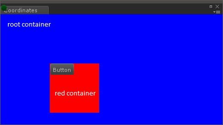

# The Visual Tree
可视树将所有可视元素保存在一个窗口中。它是由称为可视元素的轻量级节点组成的对象图。

这些节点可以手动或通过从UXML模板文件加载UXML资产在C＃堆上分配。

每个节点都包含布局信息，其绘制和重绘选项以及节点如何响应事件。

## VisualElement
**VisualElement**是可视树中所有节点的通用基类。 **VisualElement**基类包含样式，布局数据，局部转换，事件处理程序等的属性。

**VisualElement**具有几个定义附加行为和功能的子类，包括专门的控件。 **VisualElement**可能具有子元素。

您不需要派生自**VisualElement**基类即可使用**UIElements**。您可以通过样式表和事件回调来自定义**VisualElement**的外观和行为。

## Connectivity
视觉树的根对象称为面板。在将新元素连接到面板之前，将忽略该新元素。您可以将元素添加到现有元素，以将用户界面附加到面板。

要验证VisualElement是否已连接到面板，可以测试此元素的panel属性。当未连接可视元素时，测试将返回null。

您可以在UnityEditor.UIElements命名空间中使用容器对象的rootVisualElement元素将新元素添加到树中。

## Drawing order
视觉树中的元素按以下顺序绘制：
* 父节点在子节点之前绘制
* 子节点根据子节点列表绘制

更改其绘制顺序的唯一方法是在其父级中对VisualElement对象进行重新排序。

## Position, transforms, and coordinate systems
不同的坐标系定义如下：
* 世界：坐标相对于面板空间。面板是视觉树中的最高元素。
* 局部：坐标是相对于元素本身的。

布局系统为每​​个元素计算`VisualElement.c`属性（`Rect`类型）。

`layout.position`用像素表示相对于其父级的坐标空间。尽管您可以直接为`layout.position`分配一个值，但是建议您使用样式表和布局系统来定位元素。

每个`VisualElement`也有`layout.transform`属性（type `ITransform`），该属性将元素相对于其父元素定位。默认情况下，`transform`是标识。

`VisualElement.layout.position`和`VisualElement.layout.transform`属性定义如何在局部坐标系和父坐标系之间进行转换。

`VisualElementExtensions`静态类提供以下扩展方法，这些方法可以在坐标系统之间转换点和矩形：
* `WorldToLocal`将`Vector2`或`Rect`从面板空间转换为元素内的参照。
* `LocalToWorld`将`Vector2`或`Rect`转换为Panel空间参照
* `ChangeCoordinatesTo`将`Vector2`或`Rect`从一个元素的局部空间转换为另一元素的局部空间。

  
*Visual tree hierarchy*

例如，在上图中，树的排列如下：
* Panel 
* Tab section (refered to as `DockArea` and labelled “Coordinates”)
* Blue `VisualElement` acts as the root (refered to as “rootVisualContainer”) 
    * Red `VisualElement` acts as a parent of the button (“red container”) 
        * `Button`

从面板的角度来看：
* 面板的原点是（0，0），无论引用是什么
* root 的起源是世界空间中的（0，22）
* 红色容器的起源是世界空间中的（100，122）。它的position属性（在layout属性中定义）设置为（100，100），因为它相对于其父项：root container。
* 按钮的原点是世界空间中的（100，122）。它的position属性（在layout属性中定义）设置为（0，0），因为它相对于其父项：red container。

元素的原点是其左上角。
使用worldBound属性来检索VisualElement的窗口空间坐标，并考虑其祖先的变换和位置。