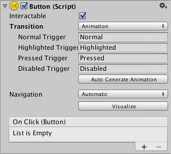

# Animation Integration
动画允许使用Unity的动画系统对控制状态之间的每个转换进行完全动画化。这是过渡模式中最强大的一种，因为可以同时设置动画的特性很多。  

要使用动画过渡模式，需要将动画组件附加到控制器元素。这可以通过单击“自动生成动画”自动完成。这也会生成一个Animator控制器，其中状态已经设置好，需要保存。

新的Animator控制器可以直接使用了。与大多数Animator控制器不同，此控制器还存储控制器变换的动画，如果需要，可以自定义这些动画。

例如，如果选择了附加了Animator控制器的Button元素，则可以通过打开Animation window（**Window>Animation**）来编辑每个按钮状态的动画。

有一个Animation Clip弹出菜单来选择所需的剪辑。从"Normal", "Highlighted", "Pressed" 和 "Disabled"中选择。

正常状态由button元素本身的值设置，可以为空。在所有其他状态下，最常见的配置是时间轴开始处的单个关键帧。状态之间的转换动画将由Animator处理。

例如，可以通过从 Animation Clip 弹出菜单中选择高亮显示的状态并将播放头置于时间线的开头来更改处于高亮显示状态的按钮的宽度：
* 选择“录制”按钮
* 在检查器中更改按钮的宽度
* 退出录制模式。

切换到播放模式以查看高亮显示时按钮的增长情况。

任何数量的属性都可以在这一个关键帧中设置其参数。

通过共享Animator控制器，多个按钮可以共享相同的行为。

**UI动画过渡模式与Unity的传统动画系统不兼容**。您应该只使用Animator组件。