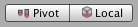

# Basic Layout
在本节中，我们将研究如何相对于Canvas以及彼此定位UI元素。如果您想在阅读时进行自我测试，可以使用菜单**GameObject -> UI -> Image**创建一个Image。

## The Rect Tool
为了布局目的，每个UI元素都表示为一个矩形。可以使用工具栏中的**Rect Tool**在**Scene View**中操作此矩形。 **Rect Tool**可用于Unity的2D功能和UI，实际上甚至可用于3D对象。  
  

Rect Tool可用于移动，调整大小和旋转UI元素。选择UI元素后，可以通过单击矩形内的任意位置并拖动来移动它。您可以通过单击边缘或拐角并拖动来调整其大小。可以通过将光标悬停在远离角的位置来旋转元素，直到鼠标光标看起来像旋转符号为止。然后，您可以单击任一方向并拖动以旋转。

与其他工具一样，Rect Tool 使用在工具栏中设置的当前枢轴模式和空间。使用UI时，通常最好将其设置为**Pivot**和**Local**。  
  

## Rect Transform
Rect Transform是一个新的转换组件，用于所有UI元素，而不是常规的Transform组件。  

与常规Transforms一样，Rect Transforms具有位置，旋转和比例，但是它也具有宽度和高度，用于指定矩形的尺寸。

## Resizing Versus Scaling
当使用Rect Tool更改对象的大小时，通常对于2D系统中的Sprite和3D对象，它将更改对象的局部比例。但是，当将其用于带有Rect变换的对象时，它将改为更改宽度和高度，从而保持局部比例不变。调整大小不会影响字体大小，切片图像上的边框等。

## Pivot
旋转，大小和缩放比例会围绕枢轴发生更改，因此枢轴的位置会影响旋转，调整大小或缩放的结果。当工具栏的**Pivot**按钮设置为**Pivot**模式时，可以在**Scene View**中移动**Rect Transform**的**Pivot**。  
  

## Anchors
Rect Transform 包括称为**anchors**的布局概念。**Anchors**在 Scene View 中显示为四个小三角形手柄，并且锚点信息也在 Inspector 中显示。

如果Rect Transform 的父级也是Rect Transform，则可以通过各种方式将子Rect Transform锚定到父Rect Transform。例如，孩子可以锚定在父节点的中心或角落之一。  

锚定还允许孩子与父母的宽度或高度一起伸展。矩形的每个角都具有与其对应锚点的固定偏移，即矩形的左上角具有与左上锚点的固定偏移，以此类推。这样，矩形的不同角可以被锚固到父矩形中的不同点。
  

锚点的位置以父矩形宽度和高度的分数（或百分比）定义。 0.0（0％）对应于左侧或底部，0.5（50％）对应于中间，1.0（100％）对应于右侧或顶部。但是，锚不仅限于侧面和中间。它们可以锚定到父矩形内的任何点。  

您可以分别拖动每个锚点，或者如果它们在一起，则可以通过在它们之间的中间单击并拖动来将它们一起拖动。如果在拖动锚点时按住Shift键，则矩形的相应角将与锚点一起移动。

锚点手柄的一个有用功能是它们会自动捕捉到同级矩形的锚点，以实现精确定位。

## Anchor presets
在Inspector中，可以在 Rect Transform 组件的左上角找到**Anchor Preset**按钮。单击该按钮将弹出**Anchor Preset**下拉列表。在这里，您可以从一些最常见的锚固选项中快速选择。您可以将UI元素锚定在父级的侧面或中间，或与父级尺寸一起拉伸。水平和垂直锚固是独立的。  
  

如果有**Anchor Preset**按钮，则显示当前选定的预设选项。如果将水平或垂直轴上的锚点设置为与任何预设不同的位置，则会显示自定义选项。

## Anchor and position fields in the Inspector
您可以单击**Anchors**扩展箭头以显示锚点数字字段（如果尚不可见）。 **Anchor Min**对应于**Scene View**中的左下锚点手柄，而**Anchor Max**对应于右上方的手柄。

矩形的位置字段根据锚是在一起（产生固定的宽度和高度）还是分开（导致矩形与父矩形一起拉伸）而不同地显示。

当所有锚点手柄在一起时，显示的字段为Pos X, Pos Y, Width 和 Height。 Pos X和Pos Y值指示轴相对于锚点的位置。

当锚分离时，字段可以部分或完全更改为`Left, Right, Top 和 Bottom`。这些字段定义由锚点定义的矩形内的填充。如果锚点水平分开，则使用`Left 和 Right`字段；如果垂直分开，则使用`Top 和 Bottom`字段。

请注意，更改锚点或枢轴字段中的值通常会反调整定位值，以使矩形保持在原位。如果不需要这样做，请通过单击检查器中的 `R` 按钮启用原始编辑模式。这使锚点和枢轴值能够被更改而不会导致其他任何值改变。因为矩形的位置和大小取决于锚点和枢轴值，所以这可能会导致矩形在视觉上移动或调整大小。