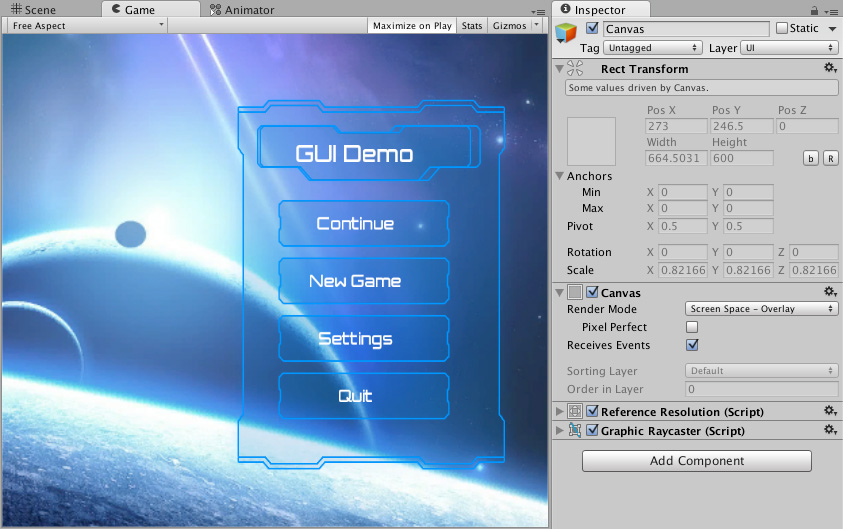
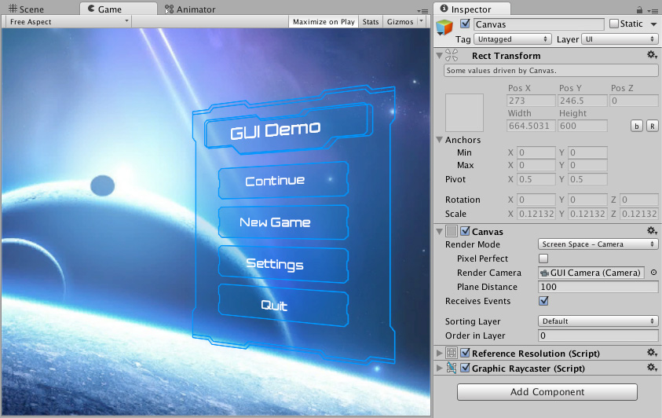
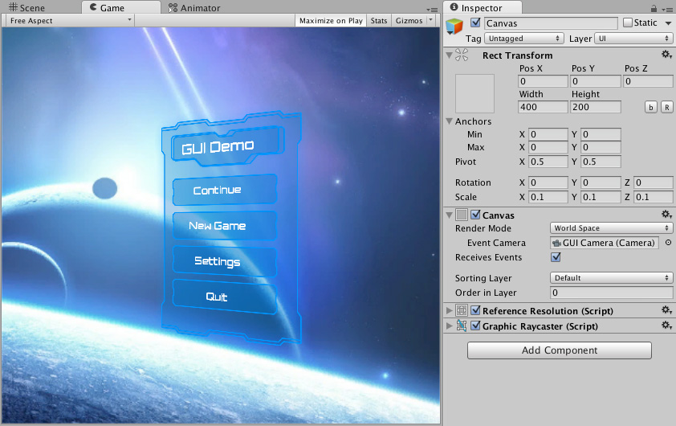

# Canvas
**Canvas**是所有UI元素都应位于其中的区域。
**Canvas**是带有**Canvas**组件的游戏对象，并且所有UI元素都必须是此类**Canvas**的子节点。

如果场景中没有**Canvas**，则使用菜单**GameObject > UI > Image**创建一个新的UI元素会自动创建一个**Canvas**。 UI元素是此**Canvas**的子级。

**Canvas**区域在“场景视图”中显示为矩形。
这样就可以轻松放置UI元素，而无需始终显示游戏视图。

**Canvas**使用EventSystem对象来帮助消息系统。

## Draw order of elements
**Canvas**中的UI元素是以它们在层次结构中出现的顺序绘制的。
首先绘制第一个子节点，然后绘制第二个子节点，依此类推。
如果两个UI元素重叠，则后一个元素将出现在前一个元素的顶部。

要更改哪个元素显示在其他元素的顶部，只需拖动层次结构中的元素即可。
通过在Transform组件上使用以下方法，也可以通过脚本控制顺序：SetAsFirstSibling，SetAsLastSibling和SetSiblingIndex。

## Render Modes
**Canvas**具有**Render Mode**设置，可用于使其在屏幕空间或世界空间中渲染。

### Screen Space - Overlay
此渲染模式将UI元素放置在场景顶部渲染的屏幕上。如果调整了屏幕大小或更改了分辨率，**Canvas**将自动更改大小以匹配此大小。   
  

### Screen Space - Camera
这类似于**Screen Space - Overlay**，但是在此渲染模式下，**Canvas**被放置在指定Camera前面给定距离。 UI元素由此相机渲染，这意味着“相机”设置会影响UI的外观。如果将“相机”设置为**Perspective**，则将使用透视图渲染UI元素，并且可以通过**Field of View**控制透视图变形量。
如果调整了屏幕大小，更改了分辨率或更改了相机的视锥体，则**Canvas**也会自动更改大小以进行匹配。  
  

### World Space
在此渲染模式下，**Canvas**将表现为场景中的任何其他对象。可以使用其Rect Transform手动设置Canvas的大小，并且UI元素将基于3D放置在场景中其他对象的前面或后面进行渲染。这对于打算成为世界一部分的UI很有用。这也称为 "diegetic interface"。  
