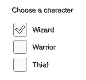
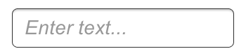

# Interaction Components
本节介绍了UI系统中处理交互的组件，例如鼠标或触摸事件以及使用键盘或控制器的交互。

交互组件本身不可见，并且必须与一个或多个[可视组件](https://docs.unity3d.com/Packages/com.unity.ugui@1.0/manual/UIVisualComponents.html)结合才能正常工作。

## Common Functionality
大多数交互组件都有一些共同点。它们是可选的，这意味着它们具有共享的内置功能，用于可视化状态（normal, highlighted, pressed, disabled）之间的过渡，以及使用键盘或控制器导航到其他可选项。此共享功能在[Selectable](https://docs.unity3d.com/Packages/com.unity.ugui@1.0/manual/script-Selectable.html)页面上进行了描述。

交互组件具有至少一个UnityEvent，当用户以特定方式与组件交互时，将调用该UnityEvent。 UI系统捕获并记录任何传播到附加到UnityEvent的代码之外的异常。

## Button
Button具有OnClick UnityEvent来定义单击时将执行的操作。  
  
有关使用Button组件的详细信息，请参见[Button](https://docs.unity3d.com/Packages/com.unity.ugui@1.0/manual/script-Button.html)页面。

## Toggle
**Toggle**具有**Is On**复选框，该复选框确定**Toggle**是当前打开还是关闭。当用户单击**Toggle**时，将翻转此值，并且可以相应地打开或关闭可视对勾。它还具有一个`OnValueChanged` UnityEvent来定义更改值时的操作。  
  
有关使用Toggle组件的详细信息，请参见[Toggle](https://docs.unity3d.com/Packages/com.unity.ugui@1.0/manual/script-Toggle.html)页面。

## Toggle Group
**Toggle Group**可用于对一组互斥的**Toggle Group**进行分组。限制属于同一组的切换，以便一次只能选择其中一个-选择其中一个会自动取消选择所有其他。  
  
有关使用**Toggle Group**组件的详细信息，请参见[**Toggle Group**](https://docs.unity3d.com/Packages/com.unity.ugui@1.0/manual/script-ToggleGroup.html)页面。

## Slider
**Slider**具有一个十进制数字**Value**，用户可以在最小值和最大值之间拖动。它可以是水平或垂直的。它还具有一个`OnValueChanged` UnityEvent来定义更改值时的操作。  

有关使用**Slider**组件的详细信息，请参见[**Slider**](https://docs.unity3d.com/Packages/com.unity.ugui@1.0/manual/script-Slider.html)页面。

## Scrollbar
**Scrollbar**的十进制数字值介于0和1之间。当用户拖动**Scrollbar**时，该值将相应更改。

**Scrollbar**通常与[**Scroll Rect**](https://docs.unity3d.com/Packages/com.unity.ugui@1.0/manual/script-ScrollRect.html)和[**Mask**](https://docs.unity3d.com/Packages/com.unity.ugui@1.0/manual/script-Mask.html)一起使用以创建滚动视图。**Scrollbar**的**Size**值介于0和1之间，该值确定手柄的大小占整个**Scrollbar**长度的一部分。通常，这是由另一个组件控制的，以指示滚动视图中可见的内容比例。滚动矩形组件可以自动执行此操作。

**Scrollbar**可以是水平或垂直的。它还具有一个`OnValueChanged` UnityEvent来定义更改值时的操作。  

有关使用**Scrollbar**组件的详细信息，请参见[Scrollbar](https://docs.unity3d.com/Packages/com.unity.ugui@1.0/manual/script-Scrollbar.html)页面。

## Dropdown
Dropdown提供了一系列选项供您选择。可以为每个选项指定一个文本字符串和一个可选的图像，可以在Inspector中设置，也可以从代码中动态设置。它具有一个`OnValueChanged` UnityEvent来定义在更改当前所选选项时将执行的操作。  

有关使用Dropdown组件的详细信息，请参见[Dropdown](https://docs.unity3d.com/Packages/com.unity.ugui@1.0/manual/script-Dropdown.html)页面。

## Input Field
Input Field 用于使[文本元素](https://docs.unity3d.com/Packages/com.unity.ugui@1.0/manual/script-Text.html)的文本可由用户编辑。它具有一个UnityEvent来定义更改文本内容时的操作，还有一个UnityEvent来定义用户完成对其进行编辑后的操作。  

有关使用 Input Field 组件的详细信息，请参见 [Input Field](https://docs.unity3d.com/Packages/com.unity.ugui@1.0/manual/script-InputField.html) 页面。

## Scroll Rect (Scroll View)
当需要在小区域显示占用大量空间的内容时，可以使用Scroll Rect。Scroll Rect提供了在此内容上滚动的功能。

通常，将Scroll Rect与Mask结合在一起以创建滚动视图，在该视图中，只有Scroll Rect内部的可滚动内容可见。它也可以与一个或两个滚动条组合使用，这些滚动条可以拖动以水平或垂直滚动​​。

有关使用Scroll Rect组件的详细信息，请参见[Scroll Rect](https://docs.unity3d.com/Packages/com.unity.ugui@1.0/manual/script-ScrollRect.html)页面。