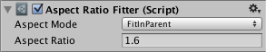

# [Aspect Ratio Fitter](https://docs.unity3d.com/Packages/com.unity.ugui@1.0/manual/script-AspectRatioFitter.html)

## Properties

|Property:|Function:
|:--------|:-------
|Aspect Mode|如何调整矩形大小以强制执行宽高比。
|&emsp;None|不要使rect适合宽高比。
|&emsp;Width Controls Height|高度会根据宽度自动调整。
|&emsp;Height Controls Width|宽度根据高度自动调整。
|&emsp;Fit In Parent|宽度，高度，位置和锚点会自动调整，以使rect适合在父对象的rect内部，同时保持宽高比。 可能是父矩形内部的一些空间，该空间未被此矩形覆盖。
|&emsp;Envelope Parent|宽度，高度，位置和锚点会自动调整，以使rect在保持宽高比的同时覆盖父对象的整个区域。 该矩形的延伸范围可能比父矩形的延伸范围大。
|Aspect Ratio|要执行的宽高比。 这是宽度除以高度。

## Description
Aspect Ratio Fitter用作布局控制器，可控制其自身布局元素的大小。 它可以调整高度以适合宽度，反之亦然，或者可以使元素适合其父元素或包围其父元素。 长宽比拟合器不考虑布局信息，例如最小尺寸和首选尺寸。

值得记住的是，当调整Rect变换的大小时（无论是通过纵横比拟合器还是其他方法），调整大小都是围绕枢轴进行的。 这意味着可以使用枢轴来控制矩形的对齐方式。 例如，放置在顶部中心的枢轴将使矩形在两侧均匀增长，并且仅在顶部边缘保持其位置的同时向下增长。