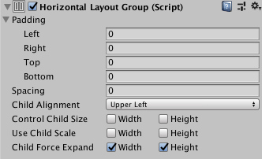

# [Horizontal Layout Group](https://docs.unity3d.com/Packages/com.unity.ugui@1.0/manual/script-HorizontalLayoutGroup.html)

“水平布局组”组件将其子布局元素并排放置。 它们的宽度由各自的最小，首选和灵活的宽度决定，具体取决于以下模型：
* 所有子布局元素的最小宽度被添加在一起，并且它们之间的间距也被添加。 结果是水平布局组的最小宽度。
* 所有子布局元素的首选宽度被添加在一起，并且它们之间的间距也被添加。 结果是“水平布局组”的首选宽度。
* 如果水平布局组的最小宽度或更小，则所有子布局元素也将具有其最小宽度。
* “水平布局”组越接近其首选宽度，每个子布局元素也将越接近其首选宽度。
* 如果水平布局组宽于其首选宽度，它将根据子布局元素各自的灵活宽度按比例分配额外的可用空间。

有关最小，首选和灵活宽度的更多信息，请参见[Auto Layout](https://docs.unity3d.com/Packages/com.unity.ugui@1.0/manual/UIAutoLayout.html)文档。

## Properties

|Property:|Function:
|:--------|:--------
|Padding|布局组边缘内的填充。
|Spacing|布局元素之间的间距。
|Child Alignment|如果子布局元素未填写所有可用空间，则使用它们的对齐方式。
|Control Child Size|布局组是否控制其子布局元素的宽度和高度。
|Use Child Scale|布局组在调整元素大小和布局时是否考虑其子布局元素的比例。    Width和Height对应于每个子布局元素的Rect变换组件中的Scale> X和Scale> Y值。
|Child Force Expand|是否强制子布局元素扩展以填充其他可用空间。