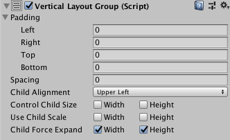

# [Vertical Layout Group](https://docs.unity3d.com/Packages/com.unity.ugui@1.0/manual/script-VerticalLayoutGroup.html)
“垂直布局组”组件将其子布局元素彼此叠加。 它们的高度由各自的最小高度，首选高度和柔性高度决定，具体取决于以下模型：
* 所有子布局元素的最小高度被加在一起，并且它们之间的间距也被添加。 结果是垂直布局组的最小高度。
* 所有子布局元素的首选高度被加在一起，并且它们之间的间距也被添加。 结果是垂直布局组的首选高度。
* 如果垂直布局组处于其最小高度或更小，则所有子布局元素也将具有其最小高度。
* “垂直布局”组越接近其首选高度，每个子布局元素也将越接近其首选高度。
* 如果“垂直布局组”比其首选高度高，它将根据子布局元素各自的灵活高度按比例分配额外的可用空间。

有关最小，首选和灵活高度的更多信息，请参见[Auto Layout](https://docs.unity3d.com/Packages/com.unity.ugui@1.0/manual/UIAutoLayout.html)上的文档。

## Properties

|Property:|Function:
|:--------|:-------
|Padding|布局组边缘内的填充。
|Spacing|布局元素之间的间距。
|Child Alignment|如果子布局元素未填写所有可用空间，则使用它们的对齐方式。
|Control Child Size|布局组是否控制其子布局元素的宽度和高度。
|Use Child Scale|布局组在调整元素大小和布局时是否考虑其子布局元素的比例。    Width和Height对应于每个子布局元素的Rect变换组件中的Scale> X和Scale> Y值。
|Child Force Expand|是否强制子布局元素扩展以填充其他可用空间。