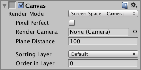
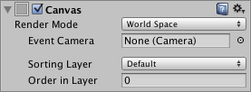

# [Canvas](https://docs.unity3d.com/Packages/com.unity.ugui@1.0/manual/class-Canvas.html)
**Canvas**组件代表在其中布局和呈现UI的抽象空间。 所有UI元素都必须是附加了**Canvas**组件的GameObject的子级。 当从菜单（**GameObject > Create UI**）创建UI元素对象时，如果场景中还没有一个Canvas对象，则会自动创建一个Canvas对象。  

## Properties
|Property:|Function:
|:--------|:---------
|Render Mode|UI呈现到屏幕或作为3D空间中的对象的方式（请参见下文）。 选项为*Screen Space - Overlay*，*Screen Space - Camera*和*World Space*。
|Pixel Perfect (Screen Space modes only)|是否应在不进行抗锯齿的情况下提高精度呈现UI？
|Render Camera (Screen Space - Camera mode only)|UI应当渲染到的相机（请参见下文）。
|Plane Distance (Screen Space - Camera mode only)|UI平面应放置在相机前面的距离。
|Event Camera (World Space mode only)|用于处理UI事件的摄像机。
|Receives Events|UI事件由此Canvas处理吗？

## Details
所有UI元素都可以使用一个Canvas，但是场景中可以使用多个Canvas。 也可以使用嵌套的Canvas，其中一个Canvas作为另一个Canvas的子对象放置，以进行优化。 嵌套的画布与其父对象使用相同的渲染模式。

传统上，UI就像直接在屏幕上绘制的简单图形设计一样呈现。 也就是说，它们不具有相机正在观看的3D空间的概念。 Unity支持这种屏幕空间渲染，但也可以根据渲染模式属性的值，将UI渲染为场景中的对象。 可用的模式为**Screen Space - Overlay**，**Screen Space - Camera**和**World Space**。

### Screen Space - Overlay
在此模式下，可以缩放画布以适合屏幕，然后直接渲染而不参考场景或相机（即使场景中根本没有相机，UI也将被渲染）。 如果更改了屏幕的大小或分辨率，则UI将自动重新缩放以适合屏幕大小。 用户界面将在其他任何图形（例如相机视图）上绘制。

注意：**Screen Space - Overlay**画布需要存储在层次结构的顶层。 如果不使用此选项，则UI可能会从视图中消失。 这是一个内置的限制。 将**Screen Space - Overlay**画布保留在层次结构的顶层，以获取预期的结果。

### Screen Space - Camera
在这种模式下，画布的绘制就像是在给定相机前面一定距离的平面对象上绘制的一样。 UI的屏幕大小不会随距离而变化，因为它始终会进行缩放以完全适合相机的[视锥范围](https://docs.unity3d.com/Manual/FrustumSizeAtDistance.html)。 如果更改了屏幕的大小或分辨率或相机的视锥，则UI将自动重新缩放以适合屏幕大小。 场景中比UI平面更靠近摄影机的3D对象将在UI前面渲染，而平面后面的对象将被遮盖。  

### World Space
此模式将UI呈现为场景中的平面对象。 但是，与**Screen Space - Camera**模式不同，该平面不必面向相机，并且可以根据自己的喜好定向。 可以使用其Rect变换来设置画布的大小，但是其屏幕上的大小将取决于摄像机的视角和距离。 其他场景对象可以在Canvas的后面，穿过或前面通过。  

## Hints
* 在[Creating a World Space UI ](https://docs.unity3d.com/Packages/com.unity.ugui@1.0/manual/HOWTO-UIWorldSpace.html)页面上了解有关设置**World Space Canvas**的更多信息。
* 有关使Canvas和UI缩放到不同分辨率或宽高比的信息，请参阅[Designing UI for Multiple Resolutions](https://docs.unity3d.com/Packages/com.unity.ugui@1.0/manual/HOWTO-UIMultiResolution.html)页面和[Canvas Scaler](https://docs.unity3d.com/Packages/com.unity.ugui@1.0/manual/script-CanvasScaler.html)页面。