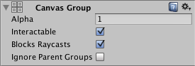

# [Canvas Group](https://docs.unity3d.com/Packages/com.unity.ugui@1.0/manual/class-CanvasGroup.html)
Canvas Group 可用于从一个位置控制整个UI元素组的某些方面，而无需分别处理它们。 Canvas Group的属性会影响其所在的GameObject以及所有子级。  

## Properties
|Property:|Function:
|:--------|:-------
|Alpha|该组中UI元素的不透明度。 该值介于0和1之间，其中0是完全透明的，而1是完全不透明的。 请注意，元素也保留其自身的透明度，因此Canvas Group alpha和各个UI元素的alpha值会彼此相乘。
|Interactable|确定此组件是否将接受输入。 设置为false时，将禁用交互。
|Block Raycasts|这个组件会充当Raycasts的对撞机吗？ 您将需要在附加到Canvas的图形射线播放器上调用RayCast函数。 这不适用于**Physics.Raycast**。
|Ignore Parent Groups|该组是否还会受到“游戏对象”层次结构中更高级的Canvas Group组件中设置的影响，还是会忽略这些设置并因此覆盖它们？

## Details
画布组的典型用途是：
* 通过在窗口的GameObject上添加画布组来淡入或淡出整个窗口，并控制其Alpha属性。
* 通过将Canvas组添加到父GameObject并将其Interactable属性设置为false，可以使整套控件不可交互（“变灰”）。
* 通过将Canvas Group组件放置在元素或其父元素之一上并将其Block Raycasts属性设置为false，可以使一个或多个UI元素不阻止鼠标事件。