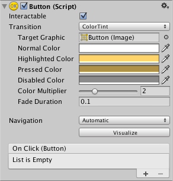

# [Button](https://docs.unity3d.com/Packages/com.unity.ugui@1.0/manual/script-Button.html)
Button控件响应用户的单击，并用于启动或确认操作。 熟悉的示例包括Web表单上使用的Submit和Cancel按钮。  

## Properties
|Property:|Function:
|:--------|:-------
|Interactable|如果希望此按钮接受输入，请启用“可交互”。 有关更多详细信息，请参见[Interactable](https://docs.unity3d.com/Packages/com.unity.ugui@1.0/manual/script-Selectable.html)上的API文档。
|Transition|确定控件可视化响应用户操作方式的属性。 请参阅[Transition Options](https://docs.unity3d.com/Packages/com.unity.ugui@1.0/manual/script-SelectableTransition.html)。
|Navigation|确定控件顺序的属性。 请参阅[导航选项](https://docs.unity3d.com/Packages/com.unity.ugui@1.0/manual/script-SelectableNavigation.html)。

## Events
|Property:|Function:
|:--------|:--------
|On Click|用户单击按钮并释放按钮时，Unity会调用一个UnityEvent。

## Details
该按钮旨在在用户单击并释放时启动操作。 如果在释放单击之前将鼠标从按钮控件上移开，则不会执行该操作。

该按钮具有一个称为“单击时”的事件，该事件在用户完成单击时响应。 典型的用例包括：
* 确认决定（例如，开始游戏或保存游戏）
* 移至GUI中的子菜单
* 取消正在进行的操作（例如，下载新场景）