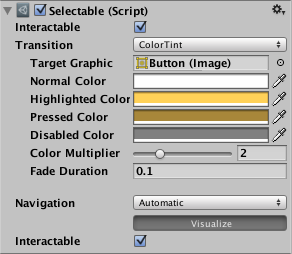

# [Transition Options](https://docs.unity3d.com/Packages/com.unity.ugui@1.0/manual/script-SelectableTransition.html)
在一个可选组件中，有几个过渡选项，具体取决于该可选组件当前处于什么状态。不同的状态是：正常，突出显示，按下和禁用。  

|Transition Options:|Function:
|:------------------|:--------------
|None|此选项使按钮完全没有状态影响。
|Color Tint|根据按钮的状态更改按钮的颜色。可以为每个单独的状态选择颜色。 也可以在不同状态之间设置淡入时间。 数字越高，颜色之间的淡入度越慢。
|Sprite Swap|根据按钮当前所处的状态，允许显示不同的精灵，可以自定义精灵。
|Animation|允许根据按钮的状态发生动画，必须存在一个动画师组件才能使用动画过渡。 确保禁用根运动很重要。 要创建动画控制器，请单击“生成动画”（或创建自己的动画），并确保已将动画控制器添加到按钮的动画器组件。

每个过渡选项（无除外）均提供用于控制过渡的其他选项。 我们将在下面的每个部分中详细介绍。

## Color Tint

|Property:|Function:
|:--------|:----------
|Target Graphic|用于交互组件的图形。
|Normal Color|控件的正常颜色
|Highlighted Color|控件突出显示时的颜色
|Pressed Color|按下控件时的颜色
|Disabled Color|控件禁用时的颜色
|Color Multiplier|这会将每个过渡的色调颜色乘以其值。 使用此功能，可以创建大于1的颜色，以使基色小于白色（或小于全alpha）的图形元素上的颜色（或alpha通道）变亮。
|Fade Duration|从一种状态消失到另一种状态所花费的时间（以秒为单位）

## Sprite Swap

|Property:|Function:
|:--------|:---------
|Target Graphic|正常使用的精灵
|Highlighted Sprite|突出显示控件时使用的精灵
|Pressed Sprite|按下控件时要使用的精灵
|Disabled Sprite|禁用控件时要使用的精灵

## Animation

|Property:|Function:
|:--------|:---------
|Normal Trigger|普通动画触发器使用
|Highlighted Trigger|突出显示控件时触发使用
|Pressed Trigger|按下控件时触发使用
|Disabled Trigger|禁用控件时触发使用