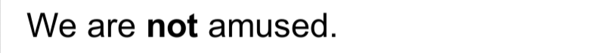
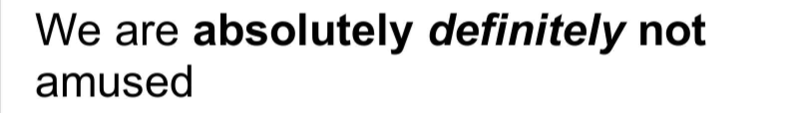
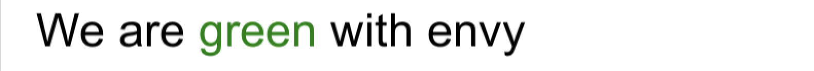
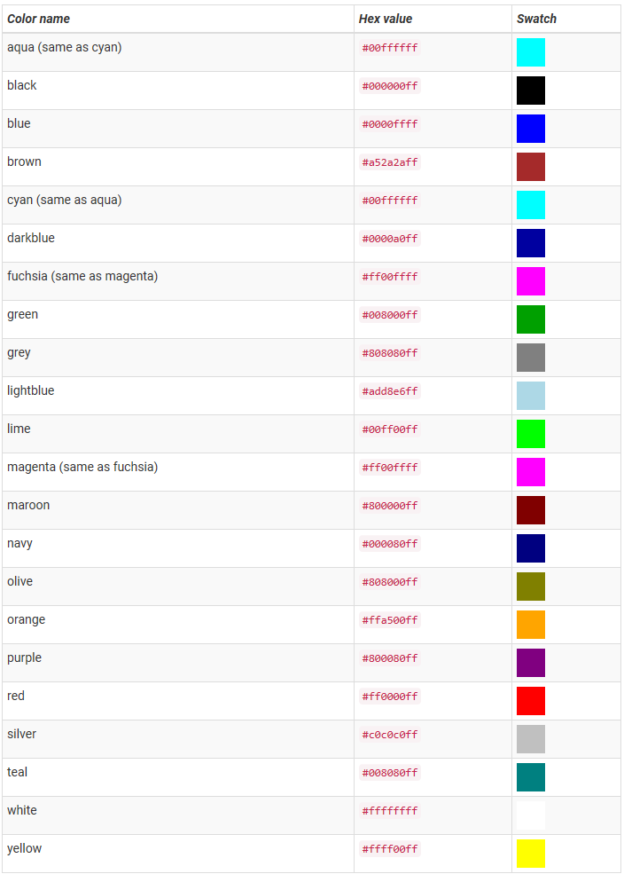

# Rich Text
UI元素的文本和文本网格可以包含多种字体样式和大小。 UI系统和旧版GUI系统均支持RTF。 Text，GUIStyle，GUIText和TextMesh类具有Rich Text设置，该设置指示Unity在文本中查找标记标签。 Debug.Log函数还可以使用这些标记标签来增强代码中的错误报告。标签不会显示，但是会指示要应用于文本的样式更改。

## Markup format
标记系统的灵感来自HTML，但并不旨在与标准HTML严格兼容。基本思想是可以将一段文本包含在一对匹配的标签内：-
```html
We are <b>not</b> amused.
```
如示例所示，标签只是“尖括号”字符`<`和`>`中的一段文本。

您将开始标签放在本节的开头。标签内的文本表示其名称（在本例中为**b**）。

您在该部分的末尾放置另一个标签。这是结束标记。它与开始标签具有相同的名称，但是名称前面带有斜杠`/`字符。每个开始标签必须有一个对应的结束标签。如果您不关闭开始标签，则将其显示为常规文本。

这些标签不会直接显示给用户，而是被解释为样式说明它们所包围的文本的说明。上面的示例中使用的b标记将粗体字应用到单词“ not”上，因此该文本在屏幕上显示为：

We are **not** amused  


文本的标记部分（包括包围它的标记）称为元素。

### Nested elements
通过将一个元素“嵌套”到另一个元素中，可以对一个文本部分应用多种样式
```html
We are <b><i>definitely not</i></b> amused
```
`<i>`标签应用了斜体样式，因此该标签将在屏幕上显示为  
We are ***definitely not*** amused  


请注意，结束标记的顺序与开始标记的顺序相反。当您考虑到内部标记不需要跨越最外部元素的整个文本时，这样做的原因也许更清楚
```html
We are <b>absolutely <i>definitely</i> not</b> amused
```
We are **absolutely *definitely not*** amused  


### Tag parameters
有些标签对文本具有简单的“全有或全无”效果，但其他标签可能允许出现变化。例如，颜色标签需要知道要应用哪种颜色。此类信息可通过以下参数添加到标签中：
```html
We are <color=green>green</color> with envy
```

产生以下结果：  


请注意，结束标记不包含参数值。 （可选）该值可以用引号引起来，但这不是必需的。

标签参数不能包含空格。例如：
```hmtml
We are <color = green>green</color> with envy
```
由于=字符两侧的空格而无法工作。

## Supported tags
下表描述了Unity支持的所有样式标签。
|Tag|Description|Example|Notes
|:---|:--------|:-------|:----
|b|用黑体字显示文本。|`We are <b>not</b> amused.`
|i|用斜体显示文本。|`We are <i>usually</i> not amused.`
|size|根据参数值设置文本大小，以像素为单位。|`We are <size=50>largely</size> unaffected.`|尽管此标记可用于Debug.Log，但如果大小设置太大，您会发现窗口栏和控制台中的行间距看起来很奇怪。
|color|根据参数值设置文本的颜色。可以使用传统的HTML格式指定颜色。 `#rrggbbaa` ...其中字母对应于十六进制数字对，表示颜色的红色，绿色，蓝色和alpha（透明度）值。例如，完全不透明的青色将由`color =＃00ffffff` ...指定。您可以以大写或小写形式指定十六进制值； `＃FF0000`等效于`＃ff0000`。|`We are <color=#ff0000ff>colorfully</color> amused`|另一种选择是使用颜色的名称。这很容易理解，但是自然会限制颜色范围，并且始终假定完全不透明。 `<color = cyan>一些文本</ color>`下表列出了可用的颜色名称。
|material|这仅对文本网格有用，并使用参数指定的材质渲染文本的一部分。该值是检查器显示的文本网格的材料数组的索引。|`We are <material=2>texturally</material> amused`
|quad|这仅对文本网格有用，并以文本形式内嵌渲染图像。它采用的参数指定用于图像的材料，以像素为单位的图像高度，以及另外四个表示要显示的图像的矩形区域的参数。与其他标签不同，quad不会围绕一段文本，因此没有结尾标签-斜杠字符位于初始标签的末尾以指示它是“自动闭合的”。|`<quad material=1 size=20 x=0.1 y=0.1 width=0.5 height=0.5>`|这将选择渲染器的材质数组中某个位置的材质，并将图像的高度设置为20像素。图像的矩形区域以x，y，宽度和高度值给定，它们均以纹理的未缩放宽度和高度的一部分给出。

## Supported colors
下表列出了可以在**<color>**富文本标记中使用名称而不是十六进制标记的颜色。



## Editor GUI
默认情况下，富文本在编辑器GUI系统中处于禁用状态，但可以使用自定义GUIStyle显式启用。应将richText属性设置为true，并将样式传递给相关的GUI函数：
```cs
GUIStyle style = new GUIStyle ();
style.richText = true;
GUILayout.Label("<size=30>Some <color=yellow>RICH</color> text</size>",style);
```