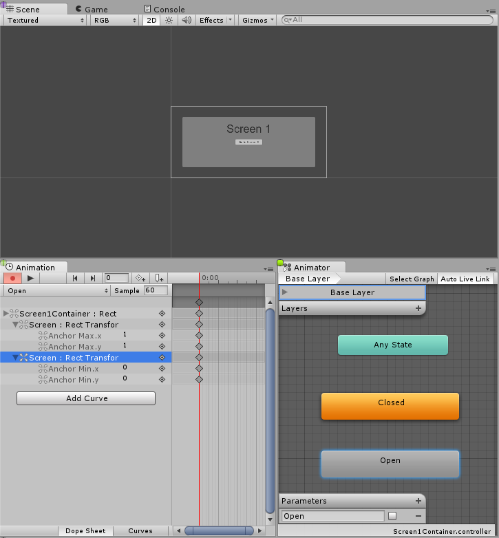

# [Creating Screen Transitions](https://docs.unity3d.com/Packages/com.unity.ugui@1.0/manual/HOWTO-UIScreenTransition.html)
在多个UI屏幕之间进行转换的需求相当普遍。 在此页面中，我们将探索一种简单的方法来创建和管理使用动画和状态机来驱动和控制每个屏幕的过渡。

## Overview
高层的想法是，我们的每个屏幕都有一个带有两个状态（打开和关闭）和布尔参数（打开）的Animator控制器。 要在屏幕之间切换，您只需要关闭当前打开的屏幕并打开所需的屏幕即可。 为了使此过程更容易，我们将创建一个小的Class ScreenManager，它将跟踪并照顾为我们关闭任何已打开的Screen。 触发转换的按钮只需要让ScreenManager打开所需的屏幕即可。

## Thinking about Navigation
如果您打算支持UI元素的控制器/键盘导航，那么请牢记一些注意事项是很重要的。 避免将Selectable元素放在屏幕外非常重要，因为这将使玩家能够选择屏幕外元素，我们可以通过停用任何屏幕外层次来实现。 我们还需要确保显示新屏幕时，将其中的一个元素设置为选中状态，否则播放器将无法导航到新屏幕。 我们将在下面的ScreenManager类中进行所有处理。

## Setting up the Animator Controller
让我们看一下动画控制器进行屏幕过渡的最常见和最少的设置。 控制器将需要一个布尔参数（Open）和两个状态（Open和Closed），每个状态都应具有仅带有一个关键帧的动画，这样我们就让状态机为我们完成过渡混合。




现在我们需要创建两个状态之间的过渡，让我们从“打开”到“关闭”的过渡开始，让我们正确设置条件，当参数“ Open”设置为false时，我们希望从“打开”到“闭合”。 现在，我们创建从Closed到Open的过渡，并在参数Open为true时将条件设置为从Closed到Open。


## Managing the screens
完成上述所有设置后，唯一缺少的是我们要在要转换的屏幕Animator上将参数Open设置为true，在当前打开的屏幕Animator上将参数Open设置为false。 为此，我们将创建一个小脚本：
```cs
using UnityEngine;
using UnityEngine.UI;
using UnityEngine.EventSystems;
using System.Collections;
using System.Collections.Generic;

public class ScreenManager : MonoBehaviour {

    //Screen to open automatically at the start of the Scene
    public Animator initiallyOpen;

    //Currently Open Screen
    private Animator m_Open;

    //Hash of the parameter we use to control the transitions.
    private int m_OpenParameterId;

    //The GameObject Selected before we opened the current Screen.
    //Used when closing a Screen, so we can go back to the button that opened it.
    private GameObject m_PreviouslySelected;

    //Animator State and Transition names we need to check against.
    const string k_OpenTransitionName = "Open";
    const string k_ClosedStateName = "Closed";

    public void OnEnable()
    {
        //We cache the Hash to the "Open" Parameter, so we can feed to Animator.SetBool.
        m_OpenParameterId = Animator.StringToHash (k_OpenTransitionName);

        //If set, open the initial Screen now.
        if (initiallyOpen == null)
            return;
        OpenPanel(initiallyOpen);
    }

    //Closes the currently open panel and opens the provided one.
    //It also takes care of handling the navigation, setting the new Selected element.
    public void OpenPanel (Animator anim)
    {
        if (m_Open == anim)
            return;

        //Activate the new Screen hierarchy so we can animate it.
        anim.gameObject.SetActive(true);
        //Save the currently selected button that was used to open this Screen. (CloseCurrent will modify it)
        var newPreviouslySelected = EventSystem.current.currentSelectedGameObject;
        //Move the Screen to front.
        anim.transform.SetAsLastSibling();

        CloseCurrent();

        m_PreviouslySelected = newPreviouslySelected;

        //Set the new Screen as then open one.
        m_Open = anim;
        //Start the open animation
        m_Open.SetBool(m_OpenParameterId, true);

        //Set an element in the new screen as the new Selected one.
        GameObject go = FindFirstEnabledSelectable(anim.gameObject);
        SetSelected(go);
    }

    //Finds the first Selectable element in the providade hierarchy.
    static GameObject FindFirstEnabledSelectable (GameObject gameObject)
    {
        GameObject go = null;
        var selectables = gameObject.GetComponentsInChildren<Selectable> (true);
        foreach (var selectable in selectables) {
            if (selectable.IsActive () && selectable.IsInteractable ()) {
                go = selectable.gameObject;
                break;
            }
        }
        return go;
    }

    //Closes the currently open Screen
    //It also takes care of navigation.
    //Reverting selection to the Selectable used before opening the current screen.
    public void CloseCurrent()
    {
        if (m_Open == null)
            return;

        //Start the close animation.
        m_Open.SetBool(m_OpenParameterId, false);

        //Reverting selection to the Selectable used before opening the current screen.
        SetSelected(m_PreviouslySelected);
        //Start Coroutine to disable the hierarchy when closing animation finishes.
        StartCoroutine(DisablePanelDeleyed(m_Open));
        //No screen open.
        m_Open = null;
    }

    //Coroutine that will detect when the Closing animation is finished and it will deactivate the
    //hierarchy.
    IEnumerator DisablePanelDeleyed(Animator anim)
    {
        bool closedStateReached = false;
        bool wantToClose = true;
        while (!closedStateReached && wantToClose)
        {
            if (!anim.IsInTransition(0))
                closedStateReached = anim.GetCurrentAnimatorStateInfo(0).IsName(k_ClosedStateName);

            wantToClose = !anim.GetBool(m_OpenParameterId);

            yield return new WaitForEndOfFrame();
        }

        if (wantToClose)
            anim.gameObject.SetActive(false);
    }

    //Make the provided GameObject selected
    //When using the mouse/touch we actually want to set it as the previously selected and
    //set nothing as selected for now.
    private void SetSelected(GameObject go)
    {
        //Select the GameObject.
        EventSystem.current.SetSelectedGameObject(go);

        //If we are using the keyboard right now, that's all we need to do.
        var standaloneInputModule = EventSystem.current.currentInputModule as StandaloneInputModule;
        if (standaloneInputModule != null)
            return;

        //Since we are using a pointer device, we don't want anything selected.
        //But if the user switches to the keyboard, we want to start the navigation from the provided game object.
        //So here we set the current Selected to null, so the provided gameObject becomes the Last Selected in the EventSystem.
        EventSystem.current.SetSelectedGameObject(null);
    }
}
```

让我们连接这个脚本，我们通过创建一个新的GameObject来实现，例如，可以将其重命名为“ ScreenManager”，并在其上面添加组件。 您可以为其分配一个初始屏幕，该屏幕将在场景开始时打开。

现在，对于最后一部分，让我们使UI按钮起作用。 选择应该触发屏幕转换的按钮，并在检查器中的“单击（）”列表下添加新操作。 将我们刚刚创建的ScreenManager GameObject拖动到ObjectField，在下拉菜单中选择ScreenManager-> OpenPanel（Animator），然后在用户单击las ObjectField的按钮时拖放要打开的面板。


## Notes
这项技术仅要求每个屏幕都具有一个带有Open参数和Closed状态的AnimatorController才能工作-不管屏幕或状态机的构造方式如何。 此技术也适用于嵌套屏幕，这意味着每个嵌套级别只需要一个ScreenManager。

我们在上面设置的状态机的默认状态为“关闭”，因此使用此控制器的所有屏幕均以关闭状态启动。 ScreenManager提供了initialOpen属性，因此您可以指定首先显示哪个屏幕。