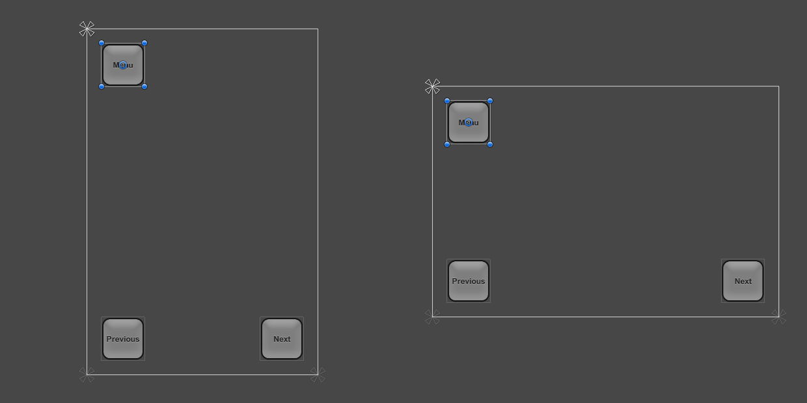
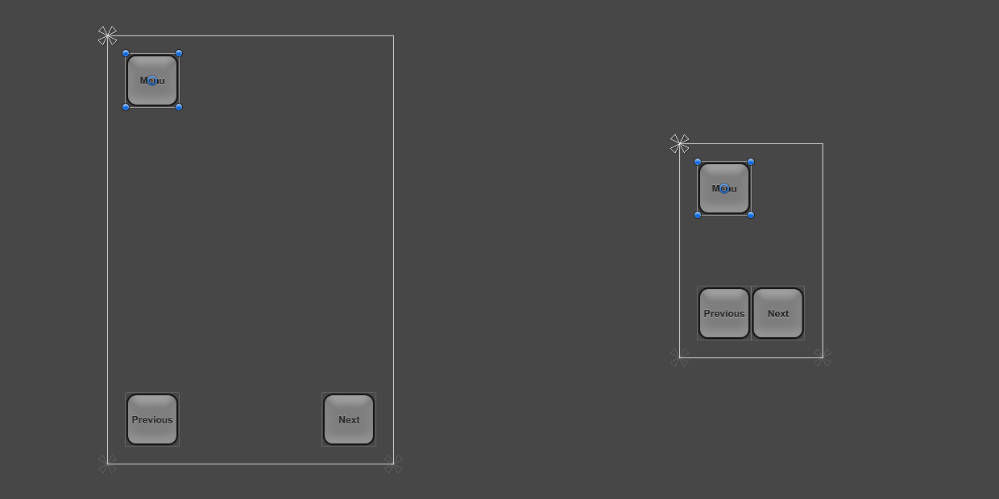
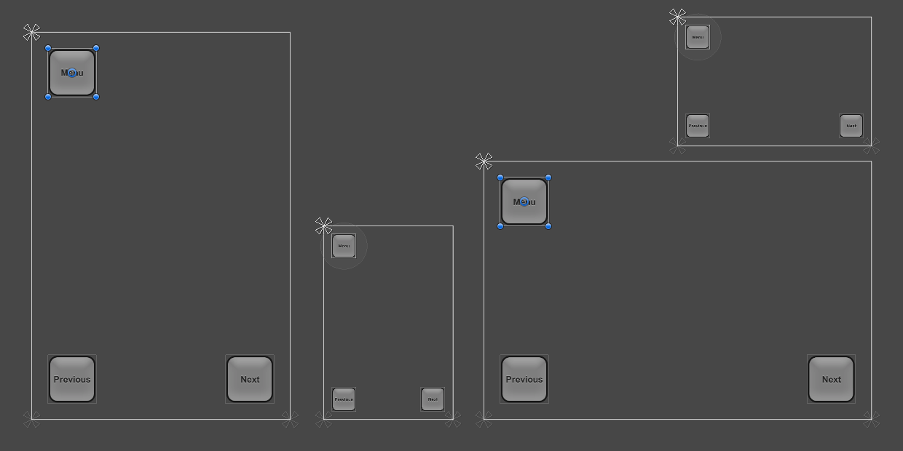

# Designing UI for Multiple Resolutions
现代游戏和应用程序通常需要支持各种不同的屏幕分辨率，尤其是UI布局需要能够适应这种分辨率。 Unity中的UI系统包括用于此目的的各种工具，可以通过各种方式进行组合。

在本操作方法中，我们将使用一个简单的案例研究，并在此背景下研究和比较不同的工具。 在我们的案例研究中，我们在屏幕的角落有三个按钮，如下所示，目标是使这种布局适应各种分辨率。  

对于此操作方法，我们将考虑四种屏幕分辨率：纵向（640 x 960）和横向（960 x 640）的手机高清以及纵向（320 x 480）和横向（480 x 320）的手机SD。 该布局最初以Phone HD纵向分辨率设置。

## Using anchors to adapt to different aspect ratios
UI元素默认情况下固定在父矩形的中心。 这意味着它们与中心保持恒定的偏移量。

如果使用此设置将分辨率更改为横向宽高比，则按钮甚至可能不再位于屏幕矩形内。

将按钮保留在屏幕内的一种方法是更改布局，以使按钮的位置绑定到屏幕各自的角上。 可以使用“检查器”中的“锚定预设”下拉列表，或通过拖动“场景视图”中的三角形锚定手柄，将左上角按钮的锚定设置为左上角。 最好在“游戏视图”中设置的当前屏幕分辨率是布局最初设计的分辨率时执行此操作，按钮位置看起来正确。 （有关锚的更多信息，请参见[UI Basic Layout](https://docs.unity3d.com/Packages/com.unity.ugui@1.0/manual/UIBasicLayout.html)页面。）类似地，可以将左下和右下按钮的锚分别设置为左下角和右下角。

将按钮固定到它们各自的角后，将分辨率更改为不同的纵横比时，它们将粘在它们上。

当屏幕大小更改为更大或更小分辨率时，按钮也将保持锚定在它们各自的角上。 但是，由于它们保持其原始尺寸（以像素为单位），因此它们可能会占据屏幕的更大或更小比例。 根据您希望布局在不同分辨率的屏幕上表现的方式，这可能不希望如此。

在本操作方法中，我们知道Phone SD Portrait和Landscape的较小分辨率并不对应于物理上较小的屏幕，而仅对应于像素密度较低的屏幕。 在这些低密度屏幕上，按钮的显示不应大于高密度屏幕上的按钮，而应以相同的大小显示。

这意味着按钮应变得与屏幕较小的百分比相同。 换句话说，按钮的比例应遵循屏幕尺寸。 这是Canvas Scaler组件可以提供帮助的地方。

## Scaling with Screen Size
可以将**Canvas Scaler**组件添加到根**Canvas**-一个带有Canvas组件的游戏对象，所有UI元素都是其子元素。 通过**GameObject**菜单创建新的Canvas时，默认情况下也会添加它。

在**Canvas Scaler**组件中，可以将其**UI Scale Mode**设置为**Scale With Screen Size**。 使用此比例模式，您可以指定要用作参考的分辨率。 如果当前屏幕分辨率小于或大于此参考分辨率，则会相应地设置Canvas的比例因子，因此所有UI元素都会与屏幕分辨率一起放大或缩小。

在我们的例子中，我们将**Canvas Scaler**设置为640 x 960的Phone HD纵向分辨率。现在，将屏幕分辨率设置为320 x 480的Phone SD纵向分辨率时，整个布局将按比例缩小，以便按比例显示 与全分辨率相同。 一切都按比例缩小：按钮大小，它们到屏幕边缘的距离，按钮图形和文本元素。 这意味着布局在Phone SD纵向分辨率下的外观与在Phone HD纵向下的外观相同； 仅具有较低的像素密度。

需要注意的一件事：添加Canvas Scaler组件后，同样重要的是还要检查布局在其他纵横比下的外观。 通过将分辨率设置回Phone HD 横向，我们可以看到按钮现在看起来比原来（过去）要大。

横向长宽比中的按钮较大的原因归结于**Canvas Scaler**设置的工作方式。 默认情况下，它将宽度或当前分辨率与Canvas Scaler的宽度进行比较，结果将用作缩放因子以缩放所有内容。 由于当前的横向分辨率960 x 640的宽是纵向分Canvas Scaler 640 x 960的1.5倍，因此布局放大了1.5倍。

该组件具有一个称为Match的属性，可以为0（宽度），1（高度）或两者之间的值。 默认情况下，它设置为0，该值将当前屏幕宽度与Canvas Scaler宽度进行比较，如所述。

如果将Match属性设置为0.5，它将同时比较当前宽度和参考宽度以及当前高度和参考高度，并选择介于两者之间的比例因子。 由于在这种情况下，纵向分辨率宽1.5倍，但也短1.5倍，因此这两个因素会保持平衡，最终比例因子为1，这意味着按钮保持其原始大小。

此时，布局通过使用适当的锚点和Canvas上的Canvas Scaler组件的组合来支持所有四个屏幕分辨率。

请参阅[Canvas Scaler](https://docs.unity3d.com/Packages/com.unity.ugui@1.0/manual/script-CanvasScaler.html)参考页，以获取有关针对不同屏幕尺寸缩放UI元素的不同方式的更多信息。