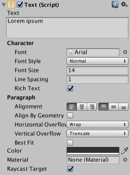

# Visual Components
随着UI系统的引入，已添加了新组件，这些组件将帮助您创建特定于GUI的功能。本节将介绍可以创建的新组件的基础。

## Text
  

**Text**组件（也称为 Label）具有用于显示输入的文本的文本区域。可以设置字体，字体样式，字体大小以及文本是否具有丰富的文本功能。

有一些选项可用于设置文本的对齐方式，用于水平和垂直溢出的设置（可控制如果文本大于矩形的宽度或高度时会发生什么）以及**Best Fit**选项，该选项可使文本调整大小以适合可用空间。

## Image
  

Image具有Rect Transform组件和**Image**组件。可以将**sprite**应用于**Image**组件下的**Source Image**字段，并可以在**Color**字段中设置其颜色。材质也可以应用于**Image**组件。 
**Image Type**字段定义了所应用的精灵的显示方式，这些选项包括：
* **Simple** - 平均缩放整个精灵。
* **Sliced** - 利用3x3精灵分割，以便调整大小不会使拐角变形，而仅拉伸中心部分。
* **Tiled** - 与**Sliced**相似，但是平铺（重复）中央部分而不是拉伸它。对于完全没有边界的精灵，将整个精灵平铺。
* **Filled** - 以与Simple相同的方式显示sprite，不同之处在于它会按定义的方向，方法和数量从原点填充sprite。

选择**Simple**或**Filled**时会显示**Set Native Size**选项，该选项可将图像重置为原始精灵大小。

通过从**Texture Type**设置中选择`Sprite（2D / UI）`，可以将图像作为**UI sprites**导入。
与旧的GUI Sprite相比，Sprite具有额外的导入设置，最大的不同是增加了Sprite编辑器。 Sprite编辑器提供了对图像进行9切片的选项，这会将图像分为9个区域，因此，如果调整Sprite的大小，则不会拉伸或扭曲拐角。  

## Raw Image
**Image**组件使用精灵，但是**Raw Image**使用纹理（无边框等）。仅应在必要时使用原始图像，否则在大多数情况下该**Image**将适用。

## Mask
**Mask**不是可见的UI控件，而是一种修改控件的子元素外观的方法。**Mask**将子元素限制（即“遮罩”）为父元素的形状。因此，如果孩子比父母大，那么只有适合孩子的部分才可见。

## Effects
视觉组件也可以应用各种简单的效果，例如简单的阴影或轮廓。有关更多信息，请参见[UI效果参考页面](https://docs.unity3d.com/Packages/com.unity.ugui@1.0/manual/comp-UIEffects.html)。