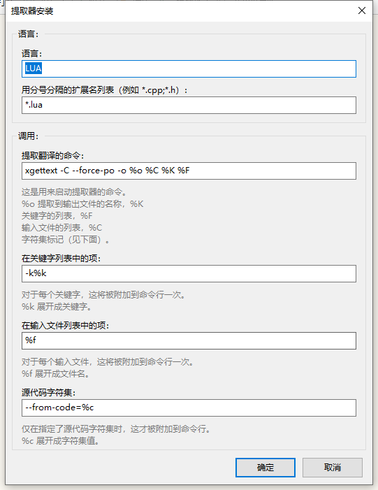
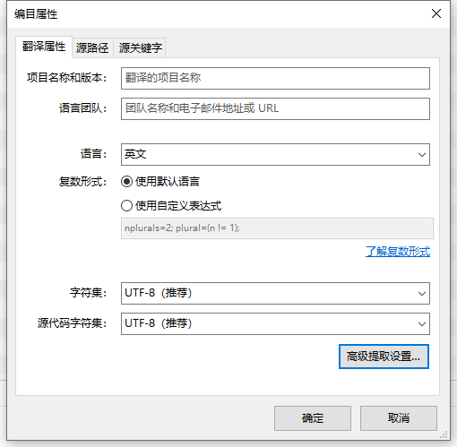
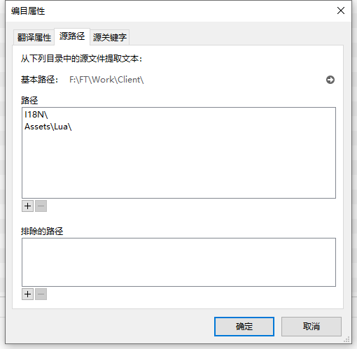
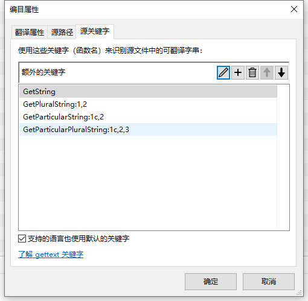

## [Poedit keywords](https://poedit.net/trac/wiki/Doc/Keywords)
* ‘-k[keywordspec]’
* ‘--keyword[=keywordspec]’
Specify keywordspec as an additional keyword to be looked for. Without a keywordspec, the option means to not use default keywords.
If keywordspec is a C identifier id, xgettext looks for strings in the first argument of each call to the function or macro id. If keywordspec is of the form ‘id:argnum’, xgettext looks for strings in the argnumth argument of the call. If keywordspec is of the form ‘id:argnum1,argnum2’, xgettext looks for strings in the argnum1st argument and in the argnum2nd argument of the call, and treats them as singular/plural variants for a message with plural handling. Also, if keywordspec is of the form ‘id:contextargnumc,argnum’ or ‘id:argnum,contextargnumc’, xgettext treats strings in the contextargnumth argument as a context specifier. And, as a special-purpose support for GNOME, if keywordspec is of the form ‘id:argnumg’, xgettext recognizes the argnumth argument as a string with context, using the GNOME glib syntax ‘"msgctxt|msgid"’. 
Furthermore, if keywordspec is of the form ‘id:...,totalnumargst’, xgettext recognizes this argument specification only if the number of actual arguments is equal to totalnumargs. This is useful for disambiguating overloaded function calls in C++. 
Finally, if keywordspec is of the form ‘id:argnum...,"xcomment"’, xgettext, when extracting a message from the specified argument strings, adds an extracted comment xcomment to the message. Note that when used through a normal shell command line, the double-quotes around the xcomment need to be escaped.

This option has an effect with most languages, namely C, C++, ObjectiveC, Shell, Python, Lisp, EmacsLisp, librep, Java, C#, awk, Tcl, Perl, PHP, GCC-source, Glade.

The default keyword specifications, which are always looked for if not explicitly disabled, are language dependent. They are:
  * For C, C++, and GCC-source: gettext, dgettext:2, dcgettext:2, ngettext:1,2, dngettext:2,3, dcngettext:2,3, gettext_noop, and pgettext:1c,2, dpgettext:2c,3, dcpgettext:2c,3, npgettext:1c,2,3, dnpgettext:2c,3,4, dcnpgettext:2c,3,4.
  * For Objective C: Like for C, and also NSLocalizedString, _, NSLocalizedStaticString, __.
  * For Shell scripts: gettext, ngettext:1,2, eval_gettext, eval_ngettext:1,2.
  * For Python: gettext, ugettext, dgettext:2, ngettext:1,2, ungettext:1,2, dngettext:2,3, _.
  * For Lisp: gettext, ngettext:1,2, gettext-noop.
  * For EmacsLisp: _.
  * For librep: _.
  * For Scheme: gettext, ngettext:1,2, gettext-noop.
  * For Java: GettextResource.gettext:2, GettextResource.ngettext:2,3, GettextResource.pgettext:2c,3, GettextResource.npgettext:2c,3,4, gettext, ngettext:1,2, pgettext:1c,2, npgettext:1c,2,3, getString.
  * For C#: GetString, GetPluralString:1,2, GetParticularString:1c,2, GetParticularPluralString:1c,2,3.
  * For awk: dcgettext, dcngettext:1,2.
  * For Tcl: ::msgcat::mc.
  * For Perl: gettext, %gettext, $gettext, dgettext:2, dcgettext:2, ngettext:1,2, dngettext:2,3, dcngettext:2,3, gettext_noop.
  * For PHP: _, gettext, dgettext:2, dcgettext:2, ngettext:1,2, dngettext:2,3, dcngettext:2,3.
  * For Glade 1: label, title, text, format, copyright, comments, preview_text, tooltip.

To disable the default keyword specifications, the option ‘-k’ or ‘--keyword’ or ‘--keyword=’, without a keywordspec, can be used.