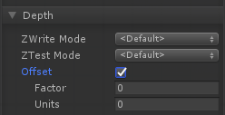

| 属性名称 | 描述 |
| :---- | :----|
|ZWrite Mode|控制是否将该对象的像素写入深度缓冲区(默认为On)。如果你在画实体，就把这个打开。如果您正在绘制半透明效果，请切换到ZWrite Off。|
|ZTest Mode|如何进行深度测试。默认是LEqual(从现有对象中或从距离中绘制对象;把物体藏在它们后面)。ASE提供ZTest更少，更大，LEqual, GEqual, Equal, NotEqual和Always。|
|Offset|允许您使用两个参数指定深度偏移量。因素和单位。因子根据多边形的X或Y缩放最大Z斜率，单位缩放最小可解析深度缓冲值。这允许你强迫一个多边形画在另一个的上面，尽管他们实际上在相同的位置。例如偏移量0，-1将多边形拉得更靠近摄像机，忽略多边形的斜率，而偏移量-1，-1将把多边形拉得更近，当观察掠角时。 **Factor**:缩放多边形相对于X或Y的最大Z斜率。 **Units**:单位缩放最小可解析深度缓冲值。|