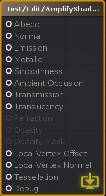

| 属性名称 | 描述 |
| :---- | :----|
| Albedo | 反射率参数控制着色器表面的基本颜色，接受颜色值或纹理贴图。 |
| Normal | 法线贴图是一种特殊的纹理，允许添加表面细节，例如从高多边形网格、凹凸、凹槽和划痕传输的阴影信息。你可以在这里连接法线贴图或自定义法线向量。|
|Emission| 自发光控制从表面发出的光的颜色和强度，而不管照明条件如何;接受完整的RGB值。|
|Metallic(Metallic workflow only)| 在金属工作流程中，通过金属级和光顺级对表面反射率和光响应进行修正;两个灰度级输入。您可以使用范围从0到1的值，影响整个表面，甚至连接一个纹理，它将控制金属值，同时为表面的不同区域提供不同的值;0为介质(非金属)，1为全金属。|
|Specular(Specular workflow only)| 在高光模式下工作时，高光参数中的RGB颜色控制着高光反射率的强度和色彩。|
|Smoothness(Both workflows)| 平滑的概念既适用于镜面工作流程，也适用于金属工作流程，两者的工作方式非常相似;灰度。值1处的完全光滑的表面提供了清晰的反射，而值0处的粗糙表面创建了没有清晰反射的漫反射颜色;它也被称为“粗糙度”在一些引擎。|
|Ambient Occlusion| 遮挡输入接受遮挡纹理贴图，或自定义值，用于提供关于模型的哪些区域应该显示高或低间接照明的信息，这些信息来自环境照明和反射。遮挡映射是灰度图像，其中白色表示应该接受完全间接照明，而黑色表示没有间接照明。|
|Transmission| 透射是一种高度优化的光散射近似方法。换句话说，它定义了当从背后照射时，有多少光穿过一个表面，这对于少许细节的资源，如树叶、布料，甚至蜡制品，是理想的;接受完整的RGB输入。|
|Translucency| 半透明输入允许您通过控制光法向角衰减偏移，以简单和优化的方式近似SSS(次表面散射)效应。它通常用于皮肤效果，但足够灵活的其他用途;接受完整的RGB输入。|
|Refraction(Transparent Render Type )| 折射输入需要一个着色器，其渲染类型设置为透明，用于模拟通过玻璃或水等介质看到的物体的变形效果，该效果是通过屏幕空间的UV偏移来实现的，可以折射背景像素;接受完整的RGB输入。这种技术是对光现象的简单近似，当波从具有给定折射率的介质以斜角传播到具有另一个介质时，通常会发生这种现象。|
|Opacity ( Transparent Render Type )|不透明度输入需要一个着色器，其渲染类型设置为透明，负责设置整个表面的透明度，使用0到1之间的值范围，从完全透明到完全不透明;接受完整的RGB输入。|
|Opacity Mask ( Transparent Render Type )| 不透明面具需要材质的渲染类型设置为透明或戴面具的混合模式,和工作类似于不透明,它接受一个值在0和1之间,从完整的透明完全不透明,但没有考虑到中间值,导致完全可见或完全不可见的表面在特定领域。对于定义复杂实体表面的材料，如钢丝网或链环，它是完美的解决方案，因为不透明的部分仍然会尊重光线;接受灰度级输入。|
|Local Vertex Offset ( Relative Vertex Output )|局部顶点偏移输入可用于通过顶点操作改变曲面的形状，其中XYZ坐标将定义每个顶点从其相对位置偏移的方式。|
|Local Vertex Position ( Absolute Vertex Output )| 局部顶点位置的工作原理与局部顶点偏移输入类似，但是，它不是从相对位置偏移每个顶点，而是从绝对世界空间方向偏移顶点。|
|Local Vertex Normal| 局部顶点法线允许调整任何偏移表面的法线方向，因为网格法线不是实时计算的。这个过程通常被称为正常重建。|
|Tessellation| 曲面细分输入允许细分网格的三角形，在运行时将它们分割成更小的三角形，以增加任何给定网格的表面细节。|
|Debug| 调试输入生成一个预览着色器，它忽略所有其他活动输入，只绘制插入到输入端口的内容，而不考虑光照。请注意，并非所有节点或特定组合都可以在调试模式下预览。|