## 编辑器（The Editor）
打开Amplify Shader Editor画布，停靠它，在一个单独的窗口中使用它，甚至在另一个监视器中使用它。双击ASE材质或着色器时，编辑器将自动打开
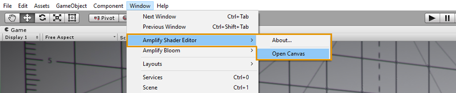
ASE着色器可以直接创建在项目标签或通过菜单下的Assets > Create > Shader > Amplify Surface Shader.
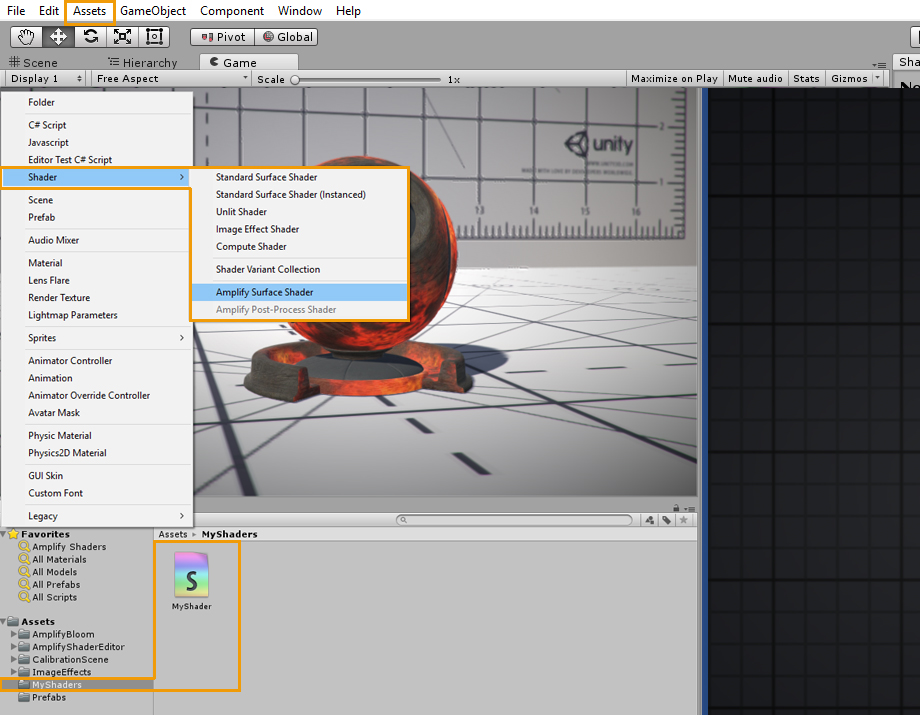
* 双击ASE着色器在ASE画布中打开它。或者，你也可以通过点击open in shader Editor按钮，在它的inspector选项卡中直接打开着色器。  
* 在节点属性标签中直接命名你的着色器，你可以使用斜杠(/)分隔符添加你自己的类别。请记住，着色器文件名是唯一的，必须在Project Explorer选项卡中手动设置。你可以为文件和实际的着色器使用不同的名字。  
* 该区域显示当前的着色器，单击它将在Project Explorer选项卡中找到并选择着色器。注意绿色的轮廓，它是一个视觉辅助工具，让你知道目前只有着色器是开放的。  
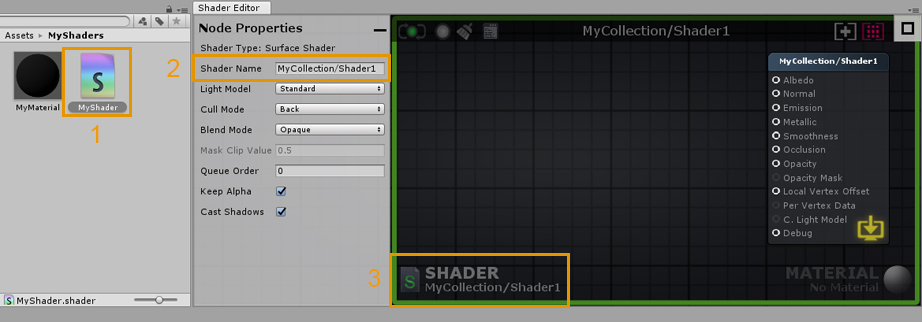  

* 双击使用ASE着色器的材质来打开ASE画布中的着色器和材质。或者，你也可以直接在材质检查器选项卡中打开它，方法是点击open in Shader Editor按钮。
* 通过打开材质，活动着色器和材质都显示在下面的画布区域。与着色器一样，单击它将在Project Explorer选项卡中找到并选择材质。注意蓝色的轮廓，它是一个视觉辅助，让你知道着色器和材质都是打开的。
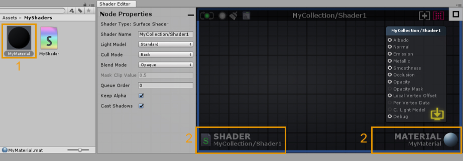

## Canvas UI Interaction
1. 节点属性可以在左侧选项卡中进行调整。选择一个节点或输出节点，以显示其参数。一些值可以在实际节点中直接进行调整。如果没有选择节点或多个节点，则输出节点属性总是显示在此选项卡上。通过单击选项卡右上角的减号按钮，可以最小化Output Node Properties选项卡。
2. 极简主义的保存/更新/清除/编辑按钮。不可用或禁用时为灰色，最新时为绿色，过时时为黄色。
    1. 按钮1:手动着色器更新(保存和更新)
    2. 按钮2:切换实时着色器更新(自动保存和更新)
    3. 按钮3:删除断开的节点
    4. 按钮4:在文本编辑器中打开着色器

3. 着色器类别和名称。

4. 画布视图调整。
    1. 按钮1:选择并聚焦于输出节点
    2. 按钮2:聚焦于选中的节点，如果没有选中任何节点，则聚焦于整个节点集合。自动缩放也可以通过双击按钮或双击“F”键来实现
5. Node Palette选项卡是一个可搜索的节点列表，您可以在其中直接选择并将节点拖出画布区域。通过单击选项卡左上角的减号按钮，可以最小化Node Palette选项卡。
6. 右键单击画布上的任何地方，以弹出可搜索的节点列表，单击节点名创建它。
7. 按住快捷键并单击画布上的任意位置以创建新节点。快捷键显示在[]内部，位于面板选项卡上它们各自的节点名前面。例如:Key ' 1 '表示浮点数，Key ' 5 '表示颜色节点。

数据从左到右流动——输入端口>处理数据>输出端口。只分析直接或间接连接到输出节点的节点，并用于生成最终的着色器指令。如果一个节点包含未连接的输入端口，ASE将在处理阶段使用内部数据。可以通过Node属性选项卡编辑内部数据值。

* Nodes 节点可以通过单击左键或左键拖动框选择。 通过按住“Shift”键并单击它，可以从选择中添加或删除节点。可以按“CTRL/CMD + A”进行全选。您也可通过在节点画布上的空白处单击左键来取消选择所有内容。按住左键并拖动则可以移动所选节点。当节点不需要的时候，可以选中节点按键盘delete键进行删除。
* Wires 通过按住“Alt”键并单击节点端口，或将连接拖动到画布空白处再点击左键，就可以删除连线。当连线有完整的前后端口连接，它就会高亮显示，表示它拥有从左至右完整的数据流。
* Connections 单击左键就可以创建连接，拖拽连线从输出端口到输入端口，或者从空输入端口到输入端口就可以完成连接。您还可以点击完整连线的端口进行切断，并拖到另一个端口形成新的连接。将连线拖到画布空白空间，会自动弹出快捷节点选项板界面，可以根据需要选择节点类型建立新的连接。

* Ports 出端口可以连接多个输入端口，但是输入端口只接受单个输入。连线还会自动捕捉到鼠标光标附近的端口。有效端口的区域很大，使得操作更为舒适。您甚至可以直接将连线放到端口名称上。
* View 按住右键或者中键可以平移整个画布的视图。当选中的框体或节点离开了可视范围后，画布将自动滚动。您还可通过滚轮放大或缩小视图显示，缩放的大小是根据画布上节点布局而定的。
* Tabs 当ASE整体界面的宽度小于750px时，节点属性界面和节点选项板界面会自动最小化。
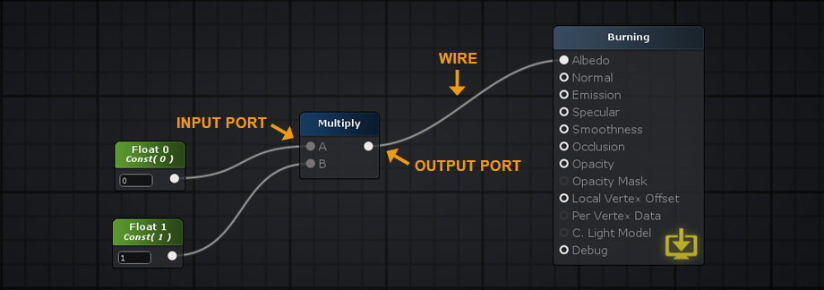

## 材质和着色器模式（Material and Shader Mode）

你可以使用ASE在两种模式之一，着色器或材质，取决于你是否从材质或材质资源加载着色器文件。画布边框作为活动模式的视觉指示器，一个绿色的轮廓显示为着色模式，一个蓝色的轮廓显示为材质模式。
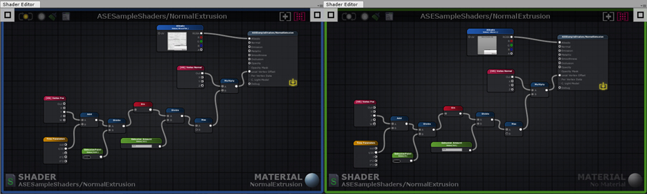

在着色器中设置的值通常称为默认值。对任何给定着色器的默认值所做的任何更改都会自动影响使用它的所有材质。当同时编辑材质和着色器时，要密切注意哪些值正在被修改。
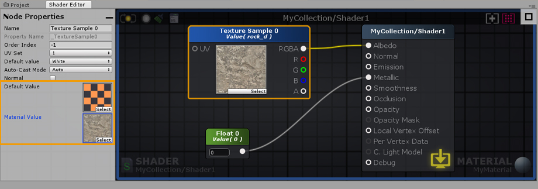

与着色器中的默认值不同，材质值可以是唯一的。材质值只在材质模式下显示(打开材质和材质)。只有表示变量(颜色、浮点数、Int、向量、矩阵)的节点具有参数类型下拉菜单，并且可以设置为属性。在选择属性或统一参数类型时，默认值总是被复制到材质值。每一种材质都可以调整，以创造无限数量的变化，同时仍然使用相同的着色器。你可以把材质当成你的着色器的实例，每个实例都是唯一的，但是使用相同的默认值创建。
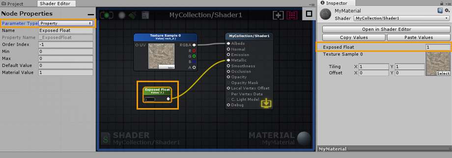

您可以复制和粘贴属性值之间的材质使用相同的ASE着色器。打开在着色器编辑器按钮提供了一个快速的方式来打开材质和着色器中使用的Amplify着色器编辑器。
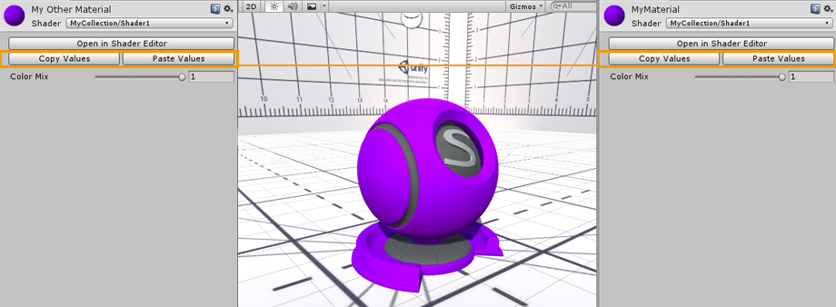

着色器也可以通过他们的检查器标签直接打开，通过点击打开在着色器编辑器按钮。或者，单击文本编辑器中的Open以在当前的代码编辑器中打开它。
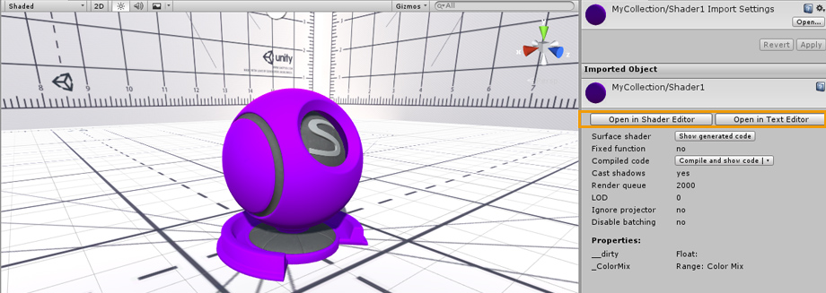

## 输出节点（Output Node）

### 输出节点面板

### General
[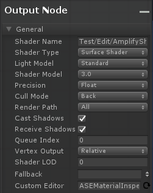](General/README.md)

### Blend Mode
[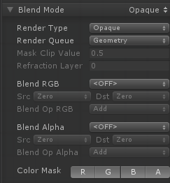](BlendMode/README.md)

### Stencil Buffer
[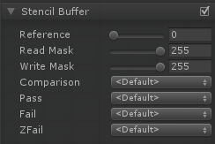](StencilBuffer/README.md)

### Tessellation

### Outline 
[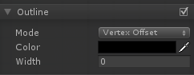](Outline/README.md)

### Billboard
[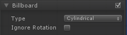](Billboard/README.md)

### Depth
[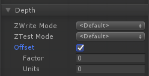](Depth/README.md)

### RenderingOptions

### RenderingPlatforms
[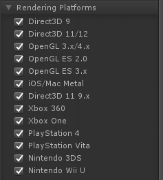](RenderingPlatforms/README.md)

### AdditionalIncludes
[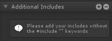](AdditionalIncludes/README.md)

### CustomSubShaderTags
[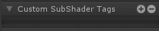](CustomSubShaderTags/README.md)

### MaterialProperties
[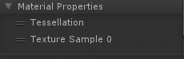](MaterialProperties/README.md)

## Referencing Custom Properties
引用自定义属性,某些着色器选项，如Cull模式或模板，也可以由着色器属性、int和float来配置，而不是由它们通常的预定义值来配置。在下拉框的旁边会有一个可点击的点，你可以用它作为一个切换来激活新的属性选择模式，通过着色器选项的列表来选择你自己的属性。
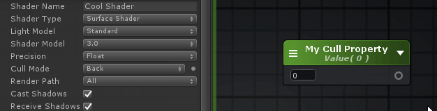

## Shader Functions
着色器函数，简称SF，是允许您构建可重用函数的单个节点网络。很容易设置和非常灵活，他们工作通过接收输入值直接从您的着色器，处理信息，并输出回进一步修改或直接使用。SF资源不绑定到任何着色器，您可以在整个项目中多次使用它们，在同一个着色器中，在其他着色器函数中，甚至与其他用户共享它们。从简单的图形到复杂的图形，着色器函数是通过将复杂的网络打包成单个节点来减少画布混乱的好方法，也是消除不必要的重复任务的好方法。
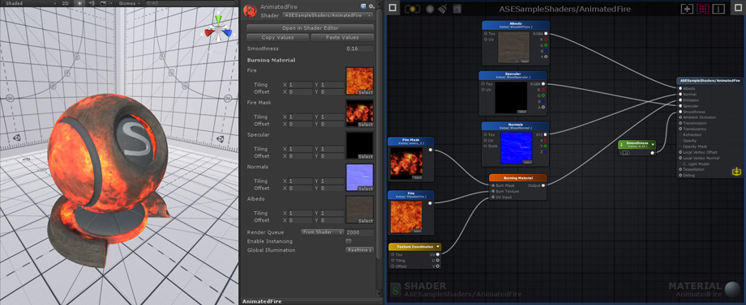

## 参考文章
[Amplify Shader Editor Wiki](http://wiki.amplify.pt/index.php?title=Unity_Products:Amplify_Shader_Editor/Scriptable_Rendering_Pipeline)
[Amplify Shader Editor官方文档（翻译）](https://blog.csdn.net/DebuggerPrisonBreak/article/details/85863719)
[Amplify Shader Editor入门教程](https://gameinstitute.qq.com/community/detail/120808)