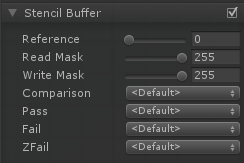

模板缓冲区可以作为每个像素掩码的通用用途，用于保存或丢弃像素。通常是每像素8位整数。该值可以被写入、递增或递减。后续的绘制调用可以对该值进行测试，以决定在运行像素着色器之前是否应该丢弃像素。当Cull模式被设置为OFF时，这个菜单会显示一组额外的比较选项，用于将缓冲区与前脸和后脸分开使用。

| 属性名称 | 描述 |
| :---- | :----|
|Reference|要比较的值(如果Comp不是总是)和/或要写入缓冲区的值(如果Pass、Fail或ZFail被设置为replace)。0 - 255整数。|
|Read Mask|一个8位的掩码作为0-255的整数，在比较引用值和缓冲区的内容(referenceValue和readMask)比较函数(stencilBufferValue和readMask)时使用。默认值:255。|
|Write Mask|一个8位掩码，0-255整数，在写入缓冲区时使用。默认值:255。|
|Comparison|用来比较参考值与缓冲区当前内容的函数。默认值:永远。|
|Pass |如果模板测试(和深度测试)通过，如何处理缓冲区的内容。默认值:。|
|Fail |如果模板测试失败，如何处理缓冲区的内容。默认值:。|
|ZFail|如果模板测试通过，深度测试失败，如何处理缓冲区的内容。默认值:。|