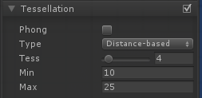

| 属性名称 | 描述 |
| :---- | :----|
|Phong|修改细分曲面的位置，使得到的曲面稍微符合网格法线;默认设置为OFF。强度:作用强度0-1。|
|Type|定义所使用的技术;基于距离的，固定的，边缘长度和边缘长度的选择。|
|Tess|曲面细分的因子;1-32.|
|Min|最小曲面细分距离。|
|Max|最大曲面细分距离。|
|Edge Length|在开始曲面细分之前，边缘的最大长度。|
|Max Disp|在多边形贴片仍然被曲面细分的截锥体边界之外的最大位移。|