## 1 Shader Graph 环境
### 1.1 安装 Shader Graph
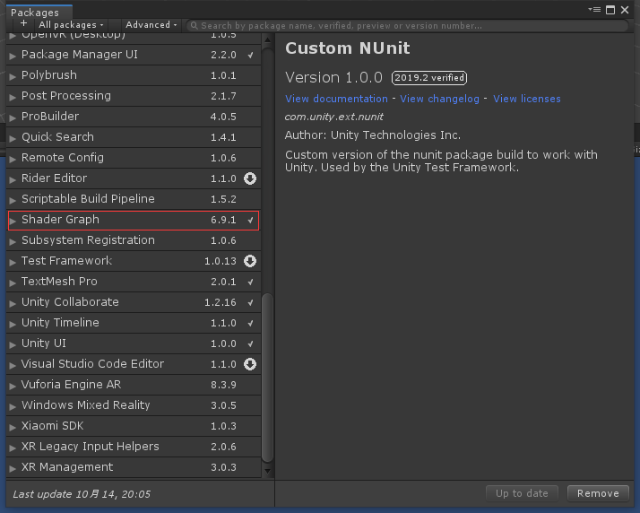

### 1.2 创建 Shader Graphs
1. 创建Shader Graphs资源
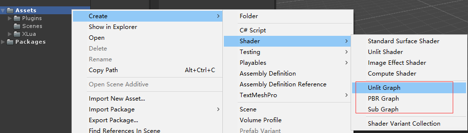  
    
2. 打开Shader Graphs资源
双击创建的资源打开 Shader Editor，将会出现下图报错  
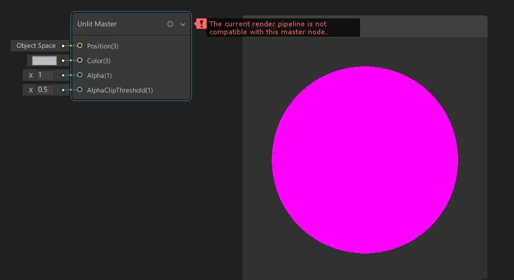  
    
    ShaderGraph 需要 Lightweight RP 或者 Hight-Definition 。
* 可以通过创建工程时选择模版，在工程初始化时包含相应模版。
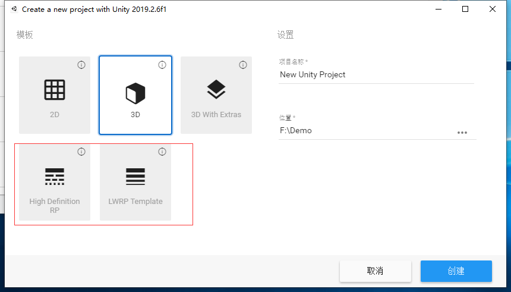  
* 也皆可以通过 PackageManager 安装相应的包。Hight-Definition 在2.09.2.6版本中还属于预览版。
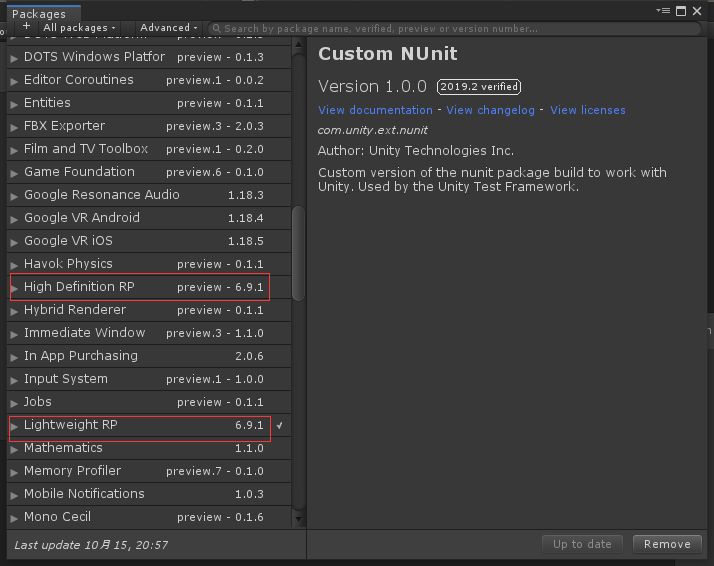  
* 在工程中创建 RP 资源
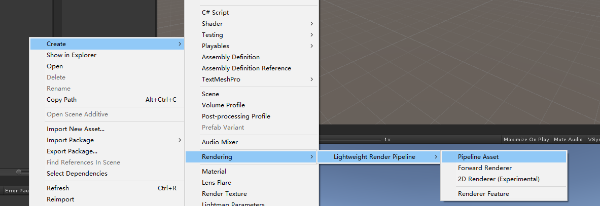  
* Edit/ProjectSetting/Graphics 初始化环境  
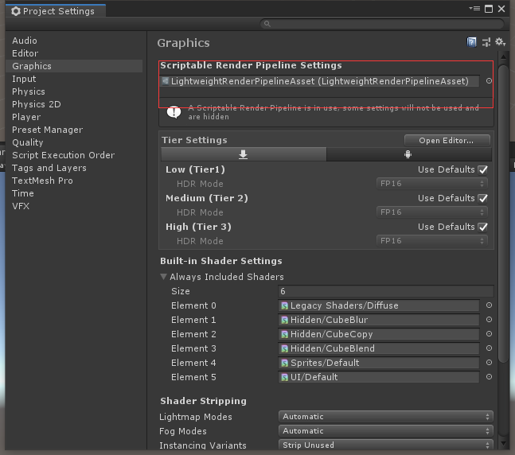  

3. Shader Graphs 配置完成
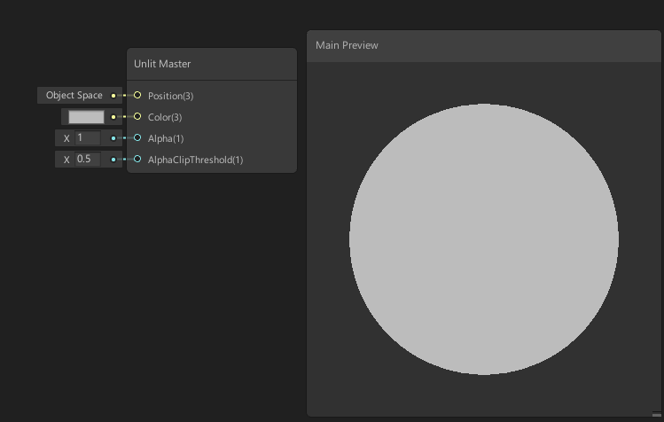  

## 2 节点
### 2.1 端口
    用于定义一个节点的输入或者输出。具有各自的数据类型。
### 2.2 连接
    用于连接不同节点间的输出和输入端口，控制数据的流动方向。
### 2.3 主节点
    每个 Shader Graph 中都具有一个主节点用来表示结束，用来表示最终的图像显示效果。

## 3 数据
### 3.1 属性类型
用于表示 Blackboard 中能定义的属性类型。用于在 Materials 的 Inspector 中暴露参数。
| Name |	Type |	Description |
| :--- | :---- | :---- |
|Display Name | String | Materials 的 Inspector 中显示的名字 |
|Exposed | Boolean | 是否将参数暴露在 Materials 的 Inspector 中 |
|Reference Name | String | Shader 中定义的变量名字 |
|Precision | Enum | 定义变量的精度 |
|Default | Type | 属性的默认值 |
|Mod | Enum | Materials 的 Inspector 中显示方式 |
|Min | Vector 1 | Mod 为 Slider 时的最小值 |
|Max | Vector 1 | Mod 为 Slider 时的最大值 |

### 3.2 数据类型
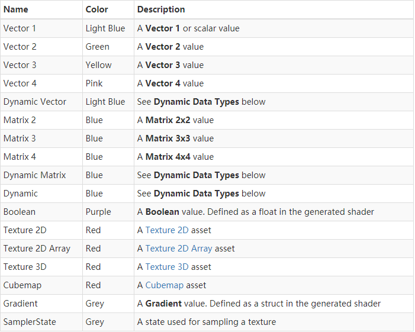  
### 3.2 端口绑定
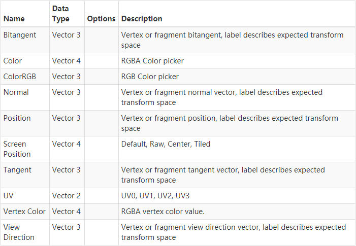  
## 2 编辑 Shader Graph
* 主节点设置
    主节点的设置现在可在一个小窗口中使用，可以打开和关闭该窗口来更改着色器的各种渲染设置。
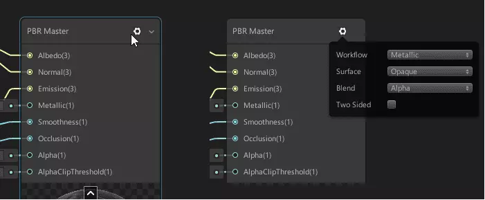  
* 属性引用名称和公开状态
    现在可以编辑属性的引用名称，从而更容易从脚本引用着色器属性。选择属性并在Reference旁边设置新名称。如果要重置为默认名称，请右键单击Reference，然后选择 Reset Reference。
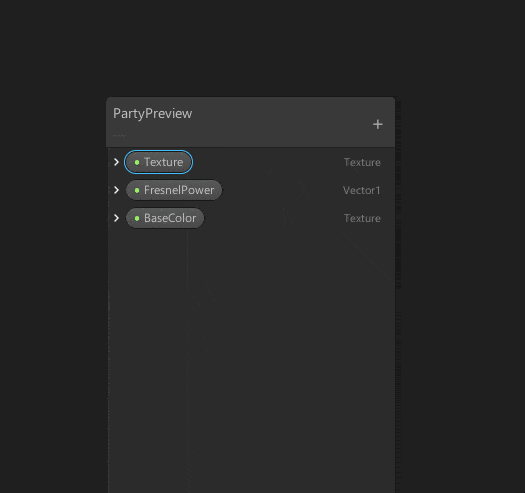  
* 可编辑路径
    现在可以更改着色器图和子图的路径。更改着色器图形的路径时，将修改其在着色器选择列表中的位置。更改子图的路径时，它将在节点创建菜单中具有不同的位置。
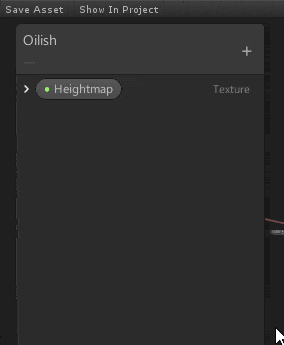  
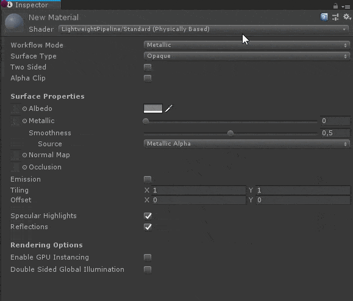  
* Is FrontFace节点
    使用此节点，你可以根据给定片段的朝向标识更改图形输出。如果当前片段是正面的一部分，则节点返回True。对于背面，节点返回False。注意：此功能需要在主节点上启用双面。
  
* 渐变节点
    通过两个新节点添加了渐变功能。Sample Gradient节点使用给定的Time参数对渐变进行采样。您可以在渐变栏位控件视图上定义此渐变。Gradient Asset节点定义了一个渐变，可以使用不同的时间参数对多个Sample Gradient节点进行采样。
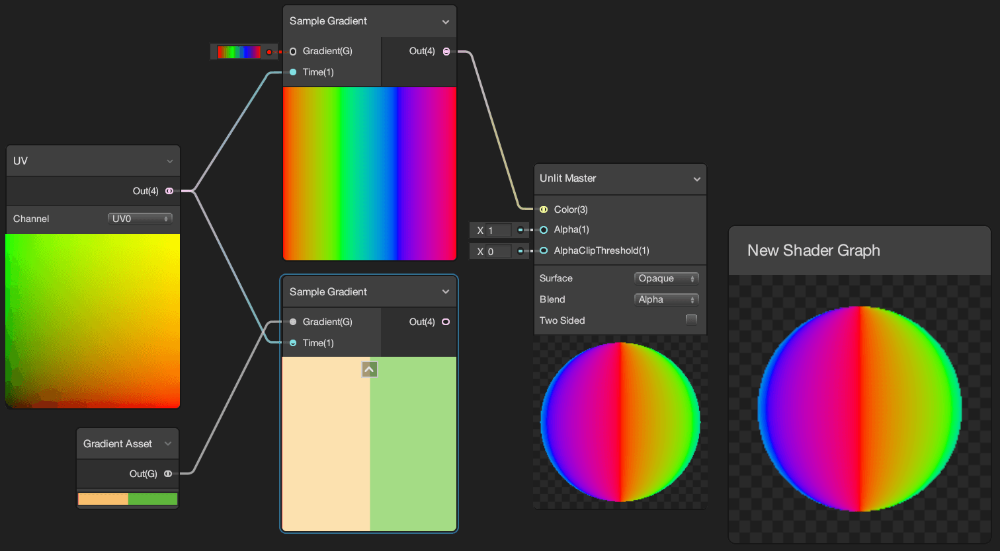  
* Texture3D和Texture2D数组
    通过两个新属性类型和四个新节点扩展了Unity对Texture类型的支持。可以在着色器图中定义和采样Texture 3D和Texture 2D Array类型资源。
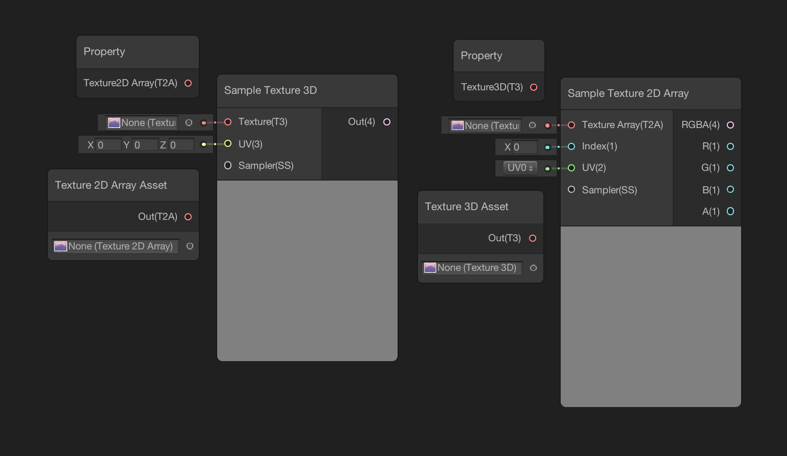  
* Texture2D LOD节点
    这个新节点为Texture 2D Sample添加了LOD功能。Sample Texture 2D LOD使用与Sample Texture 2D相同的输入和输出栏，但包括通过Vector1输入参数调整细节级别的输入。
    现在可以看到任何特定节点的生成代码。右键单击该节点，然后选择Show Generated Code。代码段将在Unity的代码编辑器中打开。
* 显示生成的代码
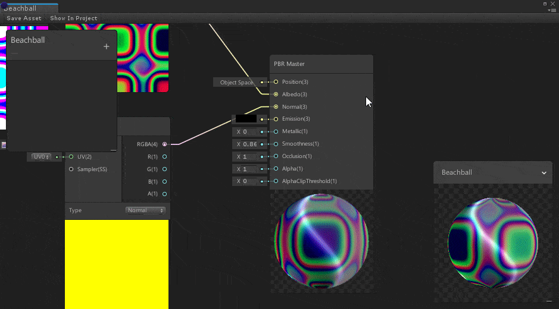  

## 参考文章
[Shader Graph](https://docs.unity3d.com/Packages/com.unity.shadergraph@6.9/manual/Getting-Started.html)
[[Unity2018.2]ShaderGraph更新详解](https://www.jianshu.com/p/6a100366142e)