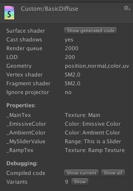
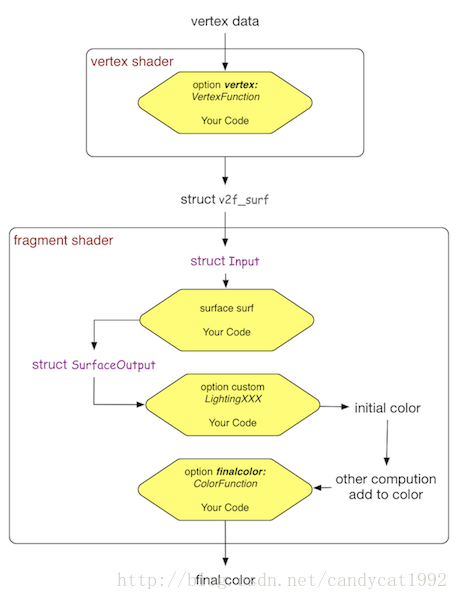

虽然Surface Shader一直是一个神秘的存在，但其实Unity给了我们揭开她面纱的方式：查看它生成的CG代码。大家应该都知道，所谓的Surface Shader实际上是封装了CG语言，隐藏了很多光照处理的细节，它的设计初衷是为了让用户仅仅使用一些指令（#pragma）就可以完成很多事情，并且封装了很多常用的光照模型和函数，例如Lambert、Blinn-Phong等。而查看Surface Shader生成的代码也很简单：在每个编译完成的Surface Shader的面板上，都有个“Show generated code”的按钮，像下面这样：



* 如果你从来没有学习过怎样编写shader，而又想写一些常见的、比较简单的shader，那仅学习Surface Shader是一个不错的选择。
* 如果你向往那些高品质的游戏画面，那么Surface Shader是远远无法满足你的，而且某种方面来说它会让你变得越来越困惑。

## 两个结构体

新建一个 Surface Shader
```
Shader "Custom/NewSurfaceShader" 
{
    Properties 
    {
        _Color ("Color", Color) = (1,1,1,1)
        _MainTex ("Albedo (RGB)", 2D) = "white" {}
        _Glossiness ("Smoothness", Range(0,1)) = 0.5
        _Metallic ("Metallic", Range(0,1)) = 0.0
    }
    SubShader {
    Tags { "RenderType"="Opaque" }
    LOD 200

    CGPROGRAM
    // Physically based Standard lighting model, and enable shadows on all light types
    #pragma surface surf Standard fullforwardshadows

    // Use shader model 3.0 target, to get nicer looking lighting
    #pragma target 3.0

    sampler2D _MainTex;

    struct Input 
    {
        float2 uv_MainTex;
    };

    half _Glossiness;
    half _Metallic;
    fixed4 _Color;

    // Add instancing support for this shader. You need to check 'Enable Instancing' on materials that use the shader.
    // See https://docs.unity3d.com/Manual/GPUInstancing.html for more information about instancing.
    // #pragma instancing_options assumeuniformscaling
    UNITY_INSTANCING_CBUFFER_START(Props)
    // put more per-instance properties here
    UNITY_INSTANCING_CBUFFER_END

    void surf (Input IN, inout SurfaceOutputStandard o)
    {
        // Albedo comes from a texture tinted by color
        fixed4 c = tex2D (_MainTex, IN.uv_MainTex) * _Color;
        o.Albedo = c.rgb;
        // Metallic and smoothness come from slider variables
        o.Metallic = _Metallic;
        o.Smoothness = _Glossiness;
        o.Alpha = c.a;
    }
    ENDCG
    }
    FallBack "Diffuse"
}

```

两个结构体就是指struct Input和SurfaceOutput。其中Input结构体是允许我们自定义的。它可以包含一些纹理坐标和其他提前定义的变量，例如view direction（float3 viewDir）、world space position（worldPos）、world space reflection vector（float3 worldRefl）等。这些变量只有在真正使用的时候才会被计算生成。比如，在某些Pass里生成而某些就生成。

另一个结构体是SurfaceOutput。我们无法自定义这个结构体内的变量。关于它最难理解的也就是每个变量的具体含义以及工作机制（对像素颜色的影响）。我们来看一下它的定义（在Lighting.cginc里面）：
```
struct SurfaceOutput 
{
    fixed3 Albedo;
    fixed3 Normal;
    fixed3 Emission;
    half Specular;
    fixed Gloss;
    fixed Alpha;
};

```
* Albedo：我们通常理解的对光源的反射率。它是通过在Fragment Shader中计算颜色叠加时，和一些变量（如vertex lights）相乘后，叠加到最后的颜色上的。
* Normal：即其对应的法线方向。只要是受法线影响的计算都会受到影响。
  > c.rgb += o.Emission;
* Specular：高光反射中的指数部分的系数。影响一些高光反射的计算。按目前的理解，也就是在光照模型里会使用到（如果你没有在光照函数等函数——包括Unity内置的光照函数，中使用它，这个变量就算设置了也没用）。有时候，你只在surf函数里设置了它，但也会影响最后的结果。这是因为，你可能使用了Unity内置的光照模型，如BlinnPhong，它会使用如下语句计算高光反射的强度（在Lighting.cginc里）：
  > float spec = pow (nh, s.Specular*128.0) * s.Gloss;
* Gloss：高光反射中的强度系数。和上面的Specular类似，一般在光照模型里使用。
* Alpha：通常理解的透明通道。在Fragment Shader中会直接使用下列方式赋值（如果开启了透明通道的话）：
  > float spec = pow (nh, s.Specular*128.0) * s.Gloss;

## 编译指令
> #pragma surface surfaceFunction lightModel [optionalparams]
> 
Surface Shader和CG其他部分一样，代码也是要写在CGPROGRAM和ENDCG之间。但区别是，它必须写在SubShader内部，而不能写在Pass内部。Surface Shader自己会自动生成所需的各个Pass。由上面的编译格式可以看出，surfaceFunction和lightModel是必须指定的，而且是可选部分。

surfaceFunction通常就是名为surf的函数（函数名可以任意），它的函数格式是固定的：
 > void surf (Input IN, inout SurfaceOutput o)

即Input是输入，SurfaceOutput是输出。

lightModel也是必须指定的。由于Unity内置了一些光照函数——Lambert（diffuse）和Blinn-Phong（specular），因此这里在默认情况下会使用内置的Lambert模型。当然我们也可以自定义。

optionalparams包含了很多可用的指令类型，包括开启、关闭一些状态，设置生成的Pass类型，指定可选函数等。这里，我们只关注可指定的函数，其他可去官网自行查看。除了上述的surfaceFuntion和lightModel，我们还可以自定义两种函数：vertex:VertexFunction和finalcolor:ColorFunction。也就是说，Surface Shader允许我们自定义四种函数。

**两个结构体+四个函数**——它们在整个的render pipeline中的流程如下


从上图可以看出来，Surface Shader背后的”那些女人“就是vertex shader和fragment shader。除了VertexFunction外，另外两个结构体和三个函数都是在fragment shader中扮演了一些角色。Surface Shader首先根据我们的代码生成了很多Pass，用于forwardbase和forwardadd等，这不在本篇的讨论范围。而每个Pass的代码是基于上述四个函数生成的。

以一个Pass的代码为例，Surface Shader的生成过程简述如下：
1. 直接将CGPROGRAM和ENDCG之间的代码复制过来（其实还是更改了一些编译指令），这些代码包括了我们对Input、surfaceFuntion、LightingXXX等变量和函数的定义。这些函数和变量会在之后的处理过程中当成普通的结构体和函数进行调用，就和在C++中我们会在main函数中调用某些函数一样；

2. 分析上述代码，生成v2f_surf结构，用于在Vertex Shader和Fragment Shader之间进行数据传递。Unity会分析我们在四个自定义函数中所使用的变量，例如纹理坐标等。如果需要，它会在v2f_surf中生成相应的变量。而且，即便有时我们在Input中定义了某些变量（如某些纹理坐标），但Unity在分析后续代码时发现我们并没有使用这些变量，那么这些变量实际上是不会在v2f_surf中生成的。这也就是说，Unity做了一些优化动作。
3. 生成Vertex Shader  
   * 如果我们自定义了VertexFunction，Unity会在这里首先调用VertexFunction修改顶点数据；然后分析VertexFunction修改的数据，最后通过Input结构体将修改结果存储到v2f_surf中。
   * 计算v2f_surf中其他默认的变量值。这主要包括了pos、纹理坐标、normal（如果没有使用LightMap）、vlight（如果没有使用LightMap）、lmap（如果使用LightMap）等。
   * 最后，通过内置的TRANSFER_VERTEX_TO_FRAGMENT指令将v2f_surf传递给下面的Fragment Shader。
4. 生成Fragment Shader。
   * 使用v2f_surf中的对应变量填充Input结构，例如一些纹理坐标等。
   * 调用surfFuntion填充SurfaceOutput结构。
   * 调用LightingXXX函数得到初始的颜色值。
   * 进行其他的颜色叠加。如果没有启用LightMap，这里会使用SurfaceOutput.Albedo和v2f_surf.vlight的乘积和原颜色值进行叠加；否则会进行一些更复杂的颜色叠加。
   * 最后，如果自定了final函数，则调用它进行最后额颜色修改。

## 参考文章
[【Unity Shaders】初探Surface Shader背后的机制](https://blog.csdn.net/candycat1992/article/details/39994049)